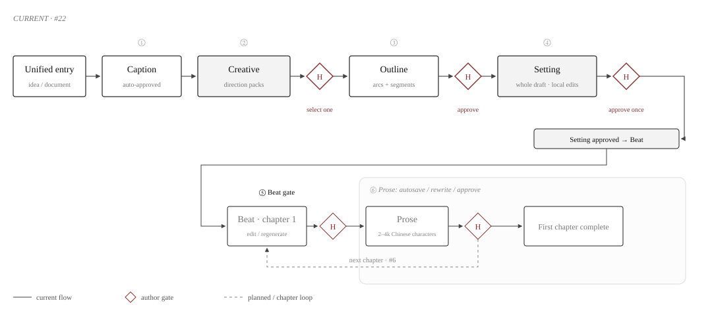
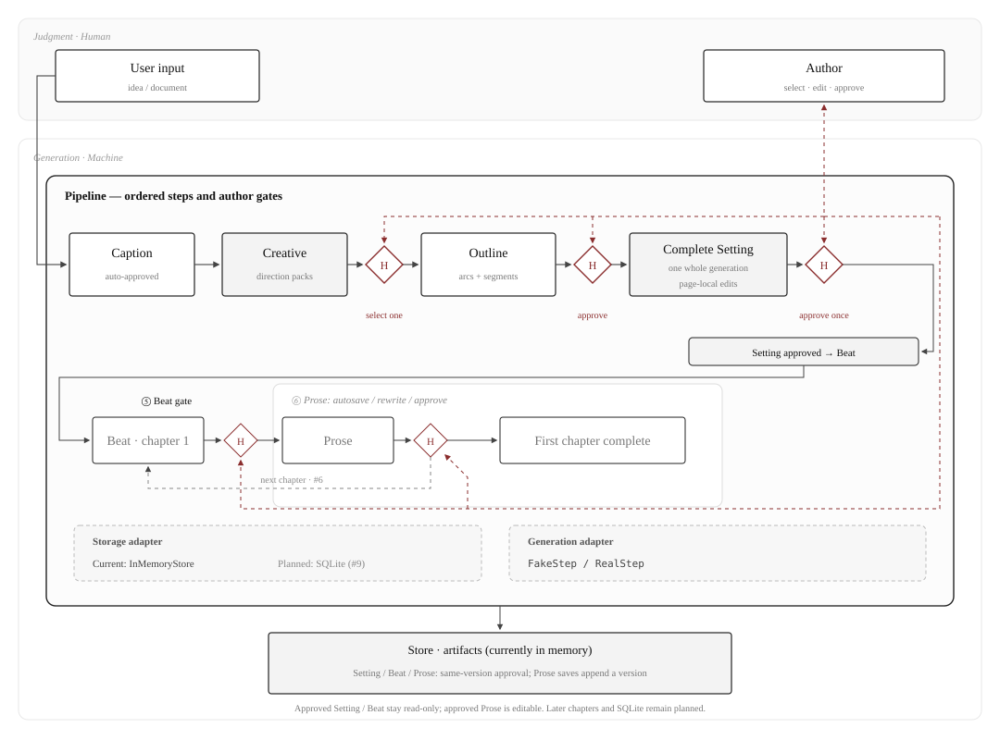

<p align="center">
  
</p>

<h1 align="center">agent4novel</h1>

<p align="center">
  <strong>From a one-line idea to a finished web-novel serial.</strong>
</p>

<p align="center">
  <a href="#current-status">Current status</a> ·
  <a href="#quick-start">Quick start</a> ·
  <a href="#how-it-works">Pipeline</a> ·
  <a href="#architecture">Architecture</a> ·
  <a href="#docs">Docs</a> ·
  <a href="#roadmap">Roadmap</a> ·
  <a href="./README.md">简体中文</a>
</p>

<p align="center">
  <a href="./LICENSE"></a>
  
  
</p>

---

Novel writing has long been a cottage craft: one author, one pen, hundreds of thousands of characters ground out word by word. agent4novel moves it onto a collaborative workflow — the AI works like an on-call editorial team, developing creative directions, structuring the outline, and filling out the setting; you are the editor-in-chief, with the final say at every author-facing gate. The goal: raw inspiration in, a finished book out.

It is built for authors who have ideas but no writing training. The chain turns a one-line idea (or an uploaded setting doc) into a distilled caption, creative directions to compare and pick, a book outline, a complete setting, and per-chapter Beat and prose with separate author gates. [#22](https://github.com/12bitsD/agent4novel/issues/22) adds prose editing, autosave, whole-chapter rewriting, and approval. First-chapter delivery evidence is recorded in [Wiki 022](./docs/wiki/022-prose-generation-review.md); continuation and chapter navigation are covered by [Wiki 006](./docs/wiki/006-chapter-continuation.md). The app and its store run locally: demo mode never calls a model service, while live mode sends the generation inputs to your configured model provider, whose privacy terms then apply.

## Current status

**Chapter continuation and navigation are implemented; the full MVP remains in development.** First-chapter [#22](https://github.com/12bitsD/agent4novel/issues/22) is delivered. [Wiki 006](./docs/wiki/006-chapter-continuation.md) records the implementation and verification of [#6](https://github.com/12bitsD/agent4novel/issues/6); its issue/PR is authoritative for delivery status.

- **Available:** idea → caption → creative direction → outline → setting → (Beat → Prose), with separate author gates for every chapter. Prose supports autosave, rewriting and editing after approval; start each next chapter explicitly and revisit earlier chapters through the directory or chapter URLs.
- **Verification:** the first chapter has fake full-workflow and real Prose-node evidence. This iteration's multi-chapter fake, CLI, Web and live-node evidence is recorded separately in Wiki 006. A few chapters do not establish full-book live-model success or long-form writing quality.
- **Remaining MVP work:** contract consolidation (#19), SQLite persistence (#9), author-facing Agent configuration (#7), and bad-example collection and analysis (#8). **Restarting the server currently loses works and edits.** Tickets remain sequential; the new Docker / CI scope will be aligned when #7 starts.

Setting retrieval/tools (#28) and Work Wiki/profile evolution (#29) remain future extensions. See the [handoff](./docs/handoff.md#当前里程碑与验证边界) for current context and the [MVP issue](https://github.com/12bitsD/agent4novel/issues/1) for the full acceptance scope.

## Quick start

```bash
pnpm install
pnpm dev        # server :8787 + web :5173
```

Open <http://localhost:5173>. No API key needed to try it: without one, the app runs in demo mode, where a built-in fake produces sample content and no real model is called.

With a real model (DeepSeek, or LongCat through its OpenAI-compatible Chat Completions endpoint):

```bash
cp .env.example .env.local
chmod 600 .env.local
# edit .env.local: set A4N_MODEL and the matching provider API key
pnpm dev
```

The server loads `.env.local` at startup and Git ignores it; environment variables already supplied by the shell or CI take precedence. If `A4N_MODEL` is explicit, its provider key is required. Without an explicit model, the server selects an available provider in this order: DeepSeek → LongCat → demo mode. Model IDs use `provider:model`, for example `longcat:LongCat-2.0` or `deepseek:deepseek-chat`.

Credentials, base URLs, and provider adapters remain server-only. `Work.config.model` is an internal per-work override seam; there is no public UI or API for changing it yet. The current LongCat adapter targets its documented Chat Completions surface, not blanket compatibility with every OpenAI protocol such as Responses. See [wiki 016](./docs/wiki/016-model-runtime-provider-config.md) for the configuration contract, safety rules, and verified cases.

LongCat defaults to thinking disabled, temperature `0.9`, and top-p `0.95`. Single-step experiments can override these through a config file or CLI flags; see [generation parameters](./docs/wiki/016-model-runtime-provider-config.md#生成参数与单节点覆盖).

### CLI (for scripts and agents)

Generation and review are also drivable from the command line — successful command results on stdout are pure JSON:

```bash
./apps/cli/bin/a4n --help                       # command list, no I/O
./apps/cli/bin/a4n save-prose --help            # input shape, example, and effects
./apps/cli/bin/a4n smoke --seed-file seed.txt   # edit/save/approve chapter-one prose and read it back
./apps/cli/bin/a4n list                         # create / get / advance / select / approve / logs …
./apps/cli/bin/a4n get work-1 --kind setting    # replace work-1 with your work ID
./apps/cli/bin/a4n approve-setting work-1 --file setting-request.json
```

Help (`--help` / `-h`) at the top level or on any command exits 0 before reading files, contacting the server, or starting a model worker. Help text goes to stderr. Unknown, duplicate, missing, or empty options and invalid argument counts fail before I/O with a safe `usage` JSON error on stderr and exit 1. `create` and `smoke` require exactly one of `--seed` and `--seed-file`. A standalone help token takes precedence; use `--seed=--help` for that literal value. Existing `--flag=value` and pnpm `--` separators remain supported. See [CLI command safety](./docs/wiki/025-cli-command-safety.md).

`setting-request.json` contains the complete `{ content, expectedHeadVersion }` request. Keep the version from the setting you reviewed: `approve-setting` never replaces it with the latest version. Automatic version lookup remains limited to `select` and `save-outline`; `smoke` exercises an actual setting edit before approval.

Beat CLI also supports `get <workId> --kind beat --chapter 1`, `regenerate-beat <workId> --file request.json`, and `approve-beat <workId> --file request.json`. Files require the target positive `chapter` number, `expectedArtifactId`, `expectedHeadVersion`, and complete `content`; regeneration additionally requires `instructions` (which may be empty). It preserves the reviewed baseline and never automatically resubmits an uncertain write. See [Wiki 005](./docs/wiki/005-beat-generation-review.md).

Prose uses `get <workId> --kind prose --chapter 1`, plus `save-prose`, `approve-prose`, and `regenerate-prose`, each with `<workId> --file request.json`. Content is `{ "text": "full chapter text" }`. Files carry the same chapter, artifact ID, and version baseline; saving also requires `expectedHumanStatus: "pending" | "approved"`, and rewriting requires `instructions`. Saving appends a version and preserves its review status; approval finalizes the pending version. Files are strict UTF-8 JSON, at most 1 MiB. An uncertain result may trigger one readback, never an automatic repeated write. See [Wiki 022](./docs/wiki/022-prose-generation-review.md).

After approving the preceding prose, run `start-chapter <workId> --file chapter-request.json` with a file such as `{ "chapter": 2, "expectedPreviousProseId": "<preceding prose ID>", "expectedPreviousProseVersion": 2 }`. It generates only the specified next Beat; then use that chapter’s Beat/Prose commands and `advance` to complete both gates. Check the business outcome as well as HTTP status. After a timeout or uncertain result, inspect the work with `get`; do not automatically replay the request or replace its baseline. The default `smoke` still checks chapter one; continuation verification is recorded in [Wiki 006](./docs/wiki/006-chapter-continuation.md).

Run one production step with supplied inputs or a custom system prompt:

```bash
./apps/cli/bin/a4n run-step caption --seed-file seed.txt \
  --system-prompt-file caption-sp.md --thinking off --temperature 0.9 --top-p 0.95
./apps/cli/bin/a4n run-step setting --input-file setting-input.json --config-file generation.json
```

`run-step` supports `caption`, `creative`, `outline`, `setting`, `beat`, and `prose` (the latter two require an explicit positive chapter number). It requires the installed full monorepo and a configured live provider, starts a local server worker, and needs no running HTTP server. It does not create or update a work. Choose exactly one of `--seed-file` and `--input-file`; downstream steps need JSON with `seed` and the required upstream `content`. Prose requires `chapter` and `upstream: { beat, setting }`. For chapter > 1, both Beat and Prose also require `upstream.previousChapter: { chapter, beat, prose }` for exactly the preceding chapter; chapter one rejects this field. A custom SP replaces only the system prompt; omitting it uses the production prompt. `--top-k` is explicitly unsupported.

Success returns schema-validated `content` and safe `telemetry` as JSON; failures write a JSON error to stderr and exit 1. Raw model output and reasoning are not returned. The worker's default total deadline is 920 seconds, overridable with `--timeout-ms` or `A4N_CLI_TIMEOUT_MS`. See [single-step inputs, limits, and output](./docs/wiki/014-agent-cli-telemetry.md#单节点实验-run-step).

Agents opening this repo get the full recipe via the bundled skill `.claude/skills/agent4novel-drive`.

## How it works

<p align="center">
  
</p>
<p align="center"><sub>Fig. 1 · Two review gates per chapter; start the next chapter explicitly</sub></p>

The internal caption interprets the source material, makes story-development judgments, and proposes concrete plot ideas, distinguishing source content from inferences and suggestions. It is auto-approved. Select a creative direction, approve the outline and setting, then edit or regenerate the current chapter’s Beat. **Approve Beat and generate prose** explicitly starts prose once that Beat is confirmed approved. Opening or refreshing a ready work does not start generation; it offers a manual generate action. Each chapter stops at `prose-approved` for reading. **Start next chapter** generates the next Beat explicitly; the app does not run ahead. Continuation uses the outline, setting and preceding chapter, without mapping each outline segment to exactly one chapter.

A Beat contains a title, goal, ordered writing-plan cards, and ending. Pending edits and regeneration instructions stay in page memory; leaving asks before discarding them. Whole-plan regeneration consumes those edits and instructions, creating a new pending version. Approval stores the final content on the same ID/version and makes it read-only. Version comparison (#20) and post-approval chapter regeneration (#21) remain separate work.

Edits to a pending setting live only in page memory: refreshing or leaving discards unsubmitted changes. Clicking **Approve** stores the edited content and approves the same artifact ID and version in one operation—there is no separate save-draft step or approval v2. The approved setting is read-only and remains the work's fixed reference; later changes and extensions belong to #17.

Prose is plain text with its whitespace preserved. Pending text autosaves to the server and can be restored after a browser refresh; it may be temporarily empty, but approval requires nonblank full text. Whole-chapter rewriting uses the current edited text and optional instructions, creates a new pending version, and preserves your input on failure. Approved prose opens for reading; **Edit** enables autosave while keeping it approved. This exception applies only to prose: it does not reopen Beat or Setting, or update a work Wiki.

Works can be reopened from the bookcase or stable work/chapter URLs. The chapter directory separates the active chapter from the chapter being read; only approved prose counts as completed. All intermediate artifacts are viewable, while approved Beat and Setting remain read-only. Editing earlier prose keeps later chapters intact and flags continuity for review; it does not rewrite or revoke approval automatically. If an actual input changes during generation, the stale result is rejected; inspect the work before explicitly retrying.

Wait for a successful save before relying on refresh recovery. Unsaved, pending or uncertain edits are protected when switching chapters. Storage is still in memory: restarting the server loses works and edits. Durable storage across restarts belongs to [#9](https://github.com/12bitsD/agent4novel/issues/9).

## Architecture

The architecture is built around **human-in-the-loop**: machines generate, authors judge, and author-facing artifacts must pass their review gates before the next step consumes them. The internal caption is the auto-approved preprocessing exception.

<p align="center">
  
</p>
<p align="center"><sub>Fig. 2 · One Pipeline drives preparation and chapter loops; saves and approval use the in-memory Store</sub></p>

- **The orchestrator (Pipeline)** drives caption → creative → outline → setting, then repeats the Beat → Prose review loop and enforces gates with a state machine (ready → awaiting-approval → complete, derived from artifact status). Caption is auto-approved; each later artifact waits for the author's explicit action. Pipeline coordinates progression, while Store's conditional writes protect the committed artifacts.
- **Steps** are contract-bound AI generations: `runStep` zod-validates both input and output, and prompts live in SKILL.md files so prompt iteration never touches code. A step doesn't know where it sits in the pipeline, which makes it independently testable and replaceable.
- **Artifacts** are grouped by "work + kind + chapter" (`{kind, chapter?, version, content, humanStatus}`). Creative, outline, and prose saves append versions. Prose saves match ID, version, and review status, then preserve that status; Setting, Beat, and Prose approval finalize content and status atomically on the same ID and version. Generation records input identities and versions for continuity checks. The public API returns each chapter's latest artifacts, not arbitrary historical versions.
- **Swappable points**: the Pipeline's dependency seams are storage (in-memory out of the box ↔ SQLite persistence in #9) and Step (`FakeStep` ↔ `RealStep`). Inside `RealStep`, `ModelRuntime` owns provider routing, credentials, base URLs, and request timeout. Switching between registered providers changes only the provider-qualified model ID; adding a provider still requires its adapter, registry entry, and key contract. Tests use fake models or mocked provider transport; executable CLI integration uses a loopback test server, never a remote model.

## Stack

<p align="center">
  
  
  
  
  
  
  
</p>

<p align="center">Vercel AI SDK v7 (<code>@ai-sdk/deepseek</code> + <code>@ai-sdk/openai-compatible</code>) · pnpm workspaces · TypeScript end-to-end</p>

```bash
pnpm test        # unit and integration tests (no remote model calls)
pnpm typecheck
pnpm build
```

## Docs

The docs in this repo are written for agents first — and read fine by humans:

| Doc | Owns |
|---|---|
| [CONTEXT.md](./CONTEXT.md) | Domain glossary (read it first) |
| [docs/schema.md](./docs/schema.md) | Data model, the single source of truth |
| [Contract governance](./docs/agents/contract-governance.md) | Ownership of executable contracts, domain models, and per-ticket decisions |
| [docs/adr/](./docs/adr/) | Irreversible decisions (orchestration, storage, skill files) |
| [docs/wiki/](./docs/wiki/) | Per-ticket engineering context: design intent, code landing, and reasons for change |
| [Ticket completion checklist](./docs/agents/ticket-completion-checklist.md) | Mandatory review, documentation, direct-push or PR/merge, and GitHub verification gate for every ticket |
| [docs/research/](./docs/research/) | Selection research (stack, LLM provider strategy) |
| [docs/handoff.md](./docs/handoff.md) | Session handoff snapshot (where we are, what's next) |

## Development process

Every ticket runs the same loop: grill and align scope → establish its Wiki context → plan → implement with TDD → run local gates → update knowledge → run three self-calibration passes → run Standards/Spec review → deliver by direct push or PR/merge → verify remotely. The [Ticket completion checklist](./docs/agents/ticket-completion-checklist.md) is the mandatory, single source of truth for that gate; the [Wiki contract](./docs/wiki/README.md) defines the per-ticket evidence format.

## Roadmap

| Ticket | What | Status |
|---|---|---|
| [#2](https://github.com/12bitsD/agent4novel/issues/2) | Scaffold + storage + pipeline skeleton + bookcase | ✅ |
| [#3](https://github.com/12bitsD/agent4novel/issues/3) | Unified entry + workspace idea state (manual chain) | ✅ |
| [#10](https://github.com/12bitsD/agent4novel/issues/10) | Preprocess RealStep + interview + outline/setting shapes | ✅ |
| [#11](https://github.com/12bitsD/agent4novel/issues/11) | Preprocess rework: caption + creative direction packs + compare view | ✅ |
| [#4](https://github.com/12bitsD/agent4novel/issues/4) | Outline: arcs + segments (two-level, chapter-free) | ✅ |
| [#14](https://github.com/12bitsD/agent4novel/issues/14) | Agent CLI + LLM telemetry + project driving skill | ✅ |
| [#16](https://github.com/12bitsD/agent4novel/issues/16) | Configurable ModelRuntime + LongCat provider | ✅ |
| [#13](https://github.com/12bitsD/agent4novel/issues/13) | Full setting after outline approval; edit locally and approve once ([engineering context](./docs/wiki/013-setting-generation-review.md)) | ✅ implemented |
| [#5](https://github.com/12bitsD/agent4novel/issues/5) | First-chapter Beat: edit, regenerate, approve ([context](./docs/wiki/005-beat-generation-review.md)) | ✅ Closed |
| [#25](https://github.com/12bitsD/agent4novel/issues/25) | Safe CLI help and strict arguments ([context](./docs/wiki/025-cli-command-safety.md)) | Implemented |
| [#22](https://github.com/12bitsD/agent4novel/issues/22) | First-chapter prose: autosave, rewrite, approve, edit after approval ([context](./docs/wiki/022-prose-generation-review.md)) | ✅ Closed |
| [#6](https://github.com/12bitsD/agent4novel/issues/6) | Subsequent chapters and chapter navigation ([context](./docs/wiki/006-chapter-continuation.md)) | Implemented; delivery status in #6 |
| [#19](https://github.com/12bitsD/agent4novel/issues/19) | Shared schemas and public contract boundaries | After #6; scope alignment first |
| [#9](https://github.com/12bitsD/agent4novel/issues/9) | SQLite after artifact design/consolidation | Planned |
| [#7](https://github.com/12bitsD/agent4novel/issues/7) | Agent configuration; new Docker / CI direction | After #9; scope to align |
| [#8](https://github.com/12bitsD/agent4novel/issues/8) | Bad-example collection | Planned; part of MVP |
| [#28](https://github.com/12bitsD/agent4novel/issues/28) | Setting search/read and bounded Agent tool execution | Future extension; does not block #6 |
| [#29](https://github.com/12bitsD/agent4novel/issues/29) | Work Wiki, evolving profiles, joint prose/profile approval | Future extension; does not block #6 |

With #5 and #22 delivered, the author's latest sequence is **#6 → [#19](https://github.com/12bitsD/agent4novel/issues/19) → #9 → #7**. #8 remains required for the MVP, with its position to be aligned. Each ticket is aligned and delivered separately; this sequence does not add dependency edges. [Post-approval setting changes #17](https://github.com/12bitsD/agent4novel/issues/17) and [conflict clarification #18](https://github.com/12bitsD/agent4novel/issues/18) remain separate follow-up work; the [#13 design](./docs/wiki/013-setting-generation-review.md) records the scope. These are planned capabilities, not current UI or storage behavior.

Work Wiki means the novel's setting and character records. #29 will define joint approval and later asynchronous updates after approved prose edits; #22 performs neither. Each future ticket requires its own scope alignment before implementation.

---

<p align="center">
  <sub><a href="./LICENSE">MIT License</a></sub><br>
  <sub>If this project speaks to you, a star or an issue is always welcome.</sub>
</p>
