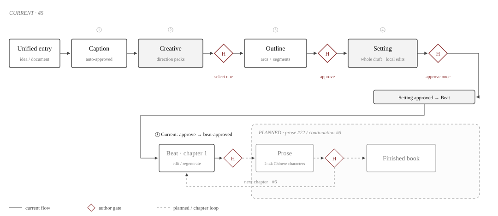
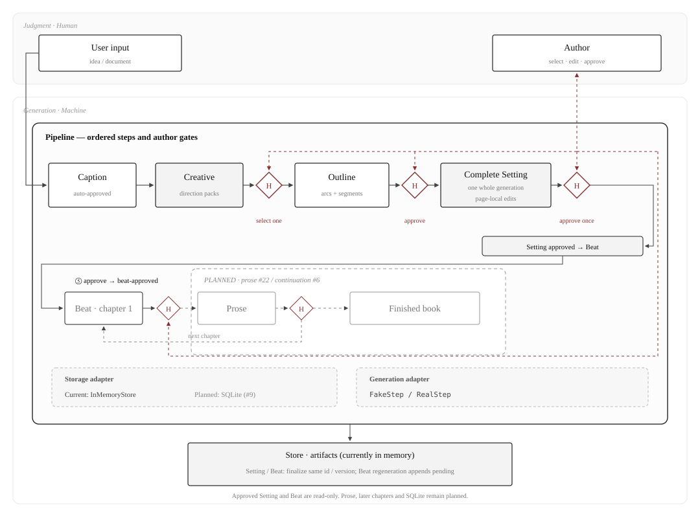

<p align="center">
  
</p>

<h1 align="center">agent4novel</h1>

<p align="center">
  <strong>From a one-line idea to a finished web-novel serial.</strong>
</p>

<p align="center">
  <a href="#quick-start">Quick start</a> ·
  <a href="#how-it-works">Pipeline</a> ·
  <a href="#architecture">Architecture</a> ·
  <a href="#docs">Docs</a> ·
  <a href="#roadmap">Roadmap</a> ·
  <a href="./README.zh-CN.md">中文</a>
</p>

<p align="center">
  <a href="./LICENSE"></a>
  
  
</p>

---

Novel writing has long been a cottage craft: one author, one pen, hundreds of thousands of characters ground out word by word. agent4novel moves it onto a modern assembly line — the AI works like an on-call editorial team, filling out worldbuilding, structuring the outline, writing chapters; you are the editor-in-chief: the direction is yours, and every gate needs your sign-off. Raw inspiration goes in; a finished book comes out.

It is built for authors who have ideas but no writing training. Give it a one-line idea (or an uploaded setting doc); it asks a few key questions back, then generates ring by ring: hooks and synopsis, the book outline, each chapter's beat sheet, each chapter's prose. Everything runs locally — single-user, open source, and your data never leaves your machine.

## Quick start

```bash
pnpm install
pnpm dev        # server :8787 + web :5173
```

Open <http://localhost:5173>. No API key needed to try it: without one, the app runs in demo mode, where a built-in fake produces sample content and no real model is called.

With a real model (DeepSeek today):

```bash
export DEEPSEEK_API_KEY=sk-...
pnpm dev
```

## How it works

<p align="center">
  
</p>
<p align="center"><sub>Fig. 1 · Pipeline and gates: boxes are agent steps / artifacts, red diamonds are human gates, dashes mark the per-chapter loop</sub></p>

Preprocessing confirms the story direction with you first; after that, every chapter gets a beat sheet before prose, and you review both. Nothing advances past a gate you haven't passed.

## Architecture

The whole architecture is built around one idea: **human-in-the-loop** — machines generate, humans judge, and the only channel between the two layers is a gate. Nothing the AI writes counts until it passes one.

<p align="center">
  
</p>
<p align="center"><sub>Fig. 2 · Human-in-the-loop, layered: judgment (human) on top, generation (machine) below; the Pipeline owns all flow control, and gates are the only channel between the layers</sub></p>

- **The orchestrator (Pipeline)** drives the step chain in a fixed order and enforces gates with a state machine (ready → awaiting-interview / awaiting-approval → complete, derived from artifact status). AI output always lands as pending; the next step unlocks only after you approve or edit-and-save. Ordering, gating and persistence logic live in this one module.
- **Steps** are contract-bound AI generations: `runStep` zod-validates both input and output, and prompts live in SKILL.md files so prompt iteration never touches code. A step doesn't know where it sits in the pipeline, which makes it independently testable and replaceable.
- **Artifacts** are filed by "work + kind + chapter" as an append-only version chain (`{kind, chapter?, version, content, humanStatus}`); any historical version is readable. A manual edit-and-save counts as approval; agent output awaits review.
- **Swappable points**: storage (in-memory out of the box ↔ SQLite persistence in #9) and model (AI SDK `createProviderRegistry` — switching providers is a string prefix, code never touches the key) are the two injection points. Tests run the whole chain on FakeStep and never touch the network.

## Stack

<p align="center">
  
  
  
  
  
  
  
</p>

<p align="center">Vercel AI SDK v7 (<code>@ai-sdk/deepseek</code>) · pnpm workspaces · TypeScript end-to-end</p>

```bash
pnpm test        # unit tests (all faked, never networked)
pnpm typecheck
pnpm build
```

## Docs

The docs in this repo are written for agents first — and read fine by humans:

| Doc | Owns |
|---|---|
| [CONTEXT.md](./CONTEXT.md) | Domain glossary (read it first) |
| [docs/schema.md](./docs/schema.md) | Data model, the single source of truth |
| [docs/adr/](./docs/adr/) | Irreversible decisions (orchestration, storage, skill files) |
| [docs/wiki/](./docs/wiki/) | Per-ticket tech plans and status logs (the only source of HOW) |
| [docs/research/](./docs/research/) | Selection research (stack, LLM provider strategy) |
| [docs/handoff.md](./docs/handoff.md) | Session handoff snapshot (where we are, what's next) |

## Development process

Every ticket runs the same loop: grill-to-align → wiki tech plan → TDD red/green slices → three self-calibration rounds → two-axis code review. See [docs/wiki/README.md](./docs/wiki/README.md).

## Roadmap

| Ticket | What | Status |
|---|---|---|
| [#2](https://github.com/12bitsD/agent4novel/issues/2) | Scaffold + storage + pipeline skeleton + bookcase | ✅ |
| [#3](https://github.com/12bitsD/agent4novel/issues/3) | Unified entry + workspace idea state (manual chain) | ✅ |
| [#10](https://github.com/12bitsD/agent4novel/issues/10) | Preprocess RealStep + interview + outline/setting shapes | ✅ |
| [#4](https://github.com/12bitsD/agent4novel/issues/4) | Outline generation | ◀ next |
| [#5](https://github.com/12bitsD/agent4novel/issues/5) | Beat/prose gates | |
| [#6](https://github.com/12bitsD/agent4novel/issues/6) | Continue writing + work detail + router | |
| [#7](https://github.com/12bitsD/agent4novel/issues/7) | Agent configuration (style / genre / payoffs) | |
| [#8](https://github.com/12bitsD/agent4novel/issues/8) | Bad-example collection | |
| [#9](https://github.com/12bitsD/agent4novel/issues/9) | SQLite persistence | |

---

<p align="center">
  <sub><a href="./LICENSE">MIT License</a></sub><br>
  <sub>If this project speaks to you, a star or an issue is always welcome.</sub>
</p>
