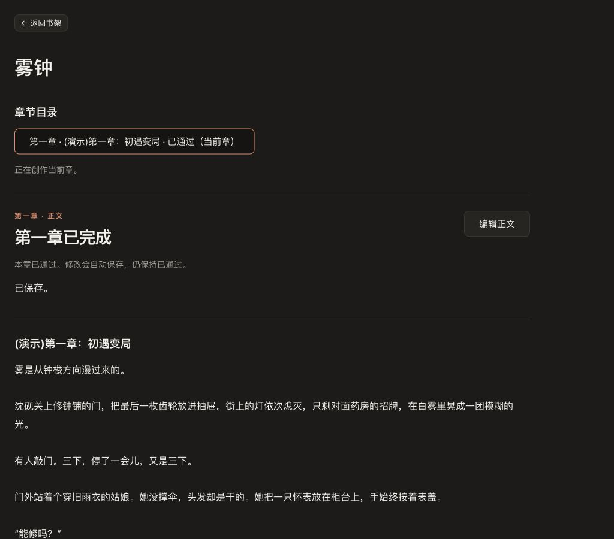
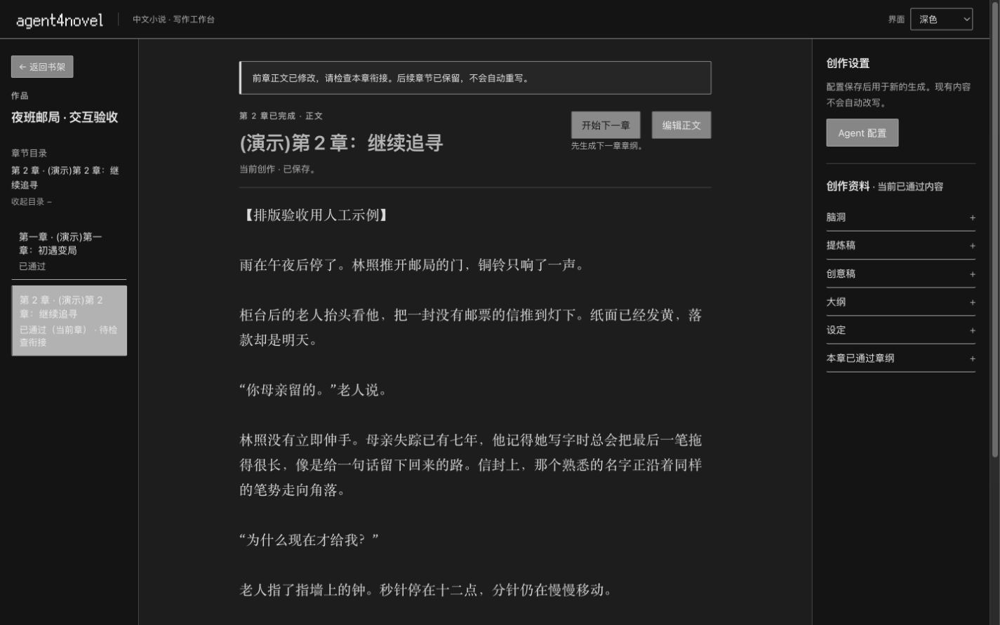

<p align="center">
  
</p>

<h1 align="center">agent4novel</h1>

<p align="center">AI 辅助的中文网文创作工具 · 本机运行，通过浏览器使用</p>

<p align="center">
  <a href="#快速开始">快速开始</a> ·
  <a href="#创作流程">创作流程</a> ·
  <a href="#文档">文档</a> ·
  <a href="./README.en.md">English</a>
</p>

输入故事想法，或导入 TXT、Markdown（`.md`）、Word（`.docx`）、PDF 文档中的文字。AI 帮你选择故事方向、规划大纲、补充设定并逐章写作；你负责修改内容、把关方向和推进下一章。



<p align="center"><sub>演示模式的实际第二章界面；正文为经编辑的示例，不代表真实模型生成效果。</sub></p>

## 当前状态

**本机最小可用版本（MVP）已交付，项目持续开发中。** 当前支持：

- 从脑洞或文档开始，选择创意稿，通过大纲与设定后进入逐章创作。
- 每章独立审阅章纲和正文；按章浏览，编辑已通过的历史正文。
- 设置文风、题材、爽点，选择模型与生成参数，上传写作指令（Prompt）和写作指导文件（Skill）。
- 在已保存的正文中选段、备注并收集坏例，保留当时原文及版本供回看。
- 本地保存作品、全部产物版本、配置、上传文件和坏例，支持服务重启与备份恢复。

## 快速开始

<a id="用-docker-启动推荐"></a>

### Docker（推荐）

安装 Git 和支持 Compose 的 Docker（例如 Docker Desktop），运行：

```bash
git clone https://github.com/12bitsD/agent4novel.git
cd agent4novel
docker compose up --build -d --wait
```

打开 **[localhost:8787](http://localhost:8787)**。未指定模型且未提供任何 API key（模型服务密钥）时，应用使用内置示例，支持编辑和通过操作，不调用 AI。已有密钥时会启用真实模型；未指定模型时优先选择 DeepSeek，其次 LongCat。

用 `docker compose stop` 停止；`docker compose ps` 查看健康状态，`docker compose logs app` 查看启动错误。端口被占用时，运行 `A4N_HTTP_PORT=8790 docker compose up --build -d --wait`，再打开对应端口。Web 与 API 由同一服务提供，只开放本机访问。

<details>
<summary>从源码启动</summary>

<a id="从源码启动演示模式"></a>

使用项目固定版本 **Node.js 24.19.0、pnpm 12.5.1**；以下命令适用于 macOS 和 Linux。已有源码时，直接进入项目目录：

```bash
git clone https://github.com/12bitsD/agent4novel.git
cd agent4novel
pnpm install --frozen-lockfile
pnpm dev
```

保持终端运行，打开 **[localhost:5173](http://localhost:5173)**。首次书架为空，可直接创建作品；如需预放示例，用 `A4N_SEED_DEMO=1 pnpm dev` 启动，只会填充空书架。

命令行入口：`pnpm cli --help`。作品操作、独立节点测试与诊断见 [CLI 说明](./docs/wiki/014-agent-cli-telemetry.md)。

</details>

<a id="配置模型服务"></a>

### 接入真实模型

支持 **DeepSeek** 和 **LongCat**，从所选服务获取 API key。确认正文显示「已保存」后停止服务：Docker 用 `docker compose stop`，源码运行在终端按 `Ctrl+C`。已有 `.env.local` 时直接编辑，首次配置时创建仅当前用户可读写的文件：

```bash
cp .env.example .env.local
chmod 600 .env.local
```

在 `.env.local` 中填写以下一种配置，其他项保留原值：

| 模型服务 | `A4N_MODEL` | 密钥字段 |
| --- | --- | --- |
| DeepSeek | `deepseek:deepseek-chat` | `DEEPSEEK_API_KEY` |
| LongCat | `longcat:LongCat-2.0` | `LONGCAT_API_KEY` |

Docker 用 `docker compose --env-file .env.local up --build -d --wait` 重启；源码运行用 `pnpm dev`。指定模型但缺少对应密钥时，启动会失败。

API key 只在运行时传入，`.env.local` 被 Git 忽略。真实模型会把生成所需的输入和故事内容发送给所选服务；完整参数见 [模型配置说明](./docs/wiki/016-model-runtime-provider-config.md#配置契约)。

<a id="它是怎么工作的"></a>

## 创作流程

系统先将输入整理为提炼稿，再进入以下流程。「通过」表示接受当前内容，作为后续生成依据。

| 阶段 | 生成内容 | 作者操作 |
| --- | --- | --- |
| 创意稿 | 默认两个故事方向，包含梗概、人物和冲突 | 比较、修改并选定一个方向 |
| 大纲 | 全书情节安排和主要冲突 | 编辑并通过 |
| 设定 | 人物、关系、世界规则等背景 | 编辑并通过 |
| 章纲 | 本章目标、内容顺序和结尾 | 编辑或重新生成，再通过 |
| 正文 | 根据章纲和设定写出的章节文字 | 编辑或整章重写，再通过 |

正文通过后，本章完成；点击正文页头的「开始下一章」生成下一章章纲。章节目录可回看旧章，已通过正文默认阅读，点击「编辑」后修改并自动保存，仍保持已通过。修改旧章后，已有后续章节保留文字与状态，并提示「待检查衔接」。

### 阅读与界面

页面顶部的「界面」可选择「跟随系统」「浅色」或「深色」，当前浏览器会记住选择。

宽屏分区显示章节、正文和创作资料；手机上章节目录默认收起，点击「章节目录」展开后选择章节，再收起目录继续阅读。资料和配置入口仍可使用。正文使用宋体风格的阅读字体，限制行宽并保留原文本换行；界面文字使用常规无衬线字体，像素字体仅用于品牌。

<details>
<summary>深色界面</summary>



演示模式的实际界面；正文为经编辑的示例，不代表真实模型生成效果。

</details>

<a id="调整创作偏好"></a>

### 调整写作配置

打开「Agent 配置」，设置文风、题材、爽点。文风用于正文，题材用于创意稿及后续内容，爽点用于创意稿、大纲、章纲和正文。高级配置支持默认模型/参数与每步覆盖，也可上传并选用 Prompt 或带 `name`、`description` 的 `SKILL.md`，最后点击「保存配置」。

保存影响下次生成；正在进行的生成沿用开始时的配置，已有内容和通过状态保留。已上传文件与已保存配置可刷新回看。模型选择需先按上文接入对应服务；演示模式仍使用内置示例。

<a id="收集正文坏例"></a>

### 收集坏例

在已保存的正文中选段，填写可选备注，点击「标记为坏例」；阅读和编辑视图均支持。「坏例收集」中可回看本章样本，后来改写不影响样本原文。切章前先标记样本，或清除选段和备注。

先保存正文并核对未确认的操作。标记结果不明确时保留页面，用「核对标记结果」确认，需要重试时点击「重试标记原请求」。

## 数据与限制

正文显示「已保存」后，刷新页面或重启服务可恢复。继续使用同一数据位置；Docker 与源码运行拥有独立的书架：

| 运行方式 | 数据位置 | 保留与切换 |
| --- | --- | --- |
| Docker | Compose 的 `data` 数据卷 | 重建容器会保留；继续使用同一 Compose 项目名称，不要删除数据卷 |
| 源码 | 默认 `.data/agent4novel.sqlite`，上传文件也在 `.data` 下 | 可用 `A4N_DATA_DIR` 指定目录；相对路径从项目根目录计算，切换空目录会显示空书架 |

<a id="保存与备份作品"></a>

**备份与恢复应先停止所有使用该数据目录的服务，并保全整个目录，包括数据库和上传文件。** 恢复前另存当前目录。详细命令见 [Docker 维护](./docs/wiki/033-local-docker-ci.md#维护操作) 和 [作品存储与恢复](./docs/wiki/009-sqlite-persistence.md)。Docker 的数据目录固定在卷内；`A4N_DATA_DIR`、`A4N_HOST`、`A4N_PORT` 用于源码运行，Docker 宿主端口用 `A4N_HTTP_PORT`。

- 未保存的正文、未提交的设定/章纲和配置修改只留在当前页面，刷新或放弃修改离开会丢失。
- 已通过的设定和章纲目前只读；续写主要承接上一章，尚无长篇设定检索或作品 Wiki。
- Prompt/Skill 只提供指导文本，不执行工具、脚本或附件；坏例用于手动回看，不自动分析、打分或改写。
- 重启不会自动恢复模型生成；先检查已保存内容，再决定继续生成。诊断日志不跨重启保留。
- 配置未保存、正在保存或结果尚未确认时，先完成保存或核对，再开始下一章。生成期间修改配置会保留当前页面；保存或明确放弃修改后，可从目录进入已生成的下一章。结果未知的配置请求需先核对，或重试原请求。
- 当前面向本机单用户，没有账号与公网访问控制；整本小说的生成质量尚未完成评估，工程验收范围见 [MVP 验证记录](./docs/wiki/001-mvp-acceptance.md#测试与验证)。

<a id="架构"></a>

## 文档

README 提供使用入口。工程上下文和验证见 [项目 Wiki](./docs/wiki/README.md)，需求与后续计划见 [Issues](https://github.com/12bitsD/agent4novel/issues)。

<a id="技术栈"></a>
<a id="开发流程"></a>
<a id="开发"></a>

<details>
<summary>开发与运行 Agent 的工程入口</summary>

- **协作规则**：[AGENTS.md](./AGENTS.md)、[完成审核清单](./docs/agents/ticket-completion-checklist.md)。
- **运行与诊断**：[运行 skill](./.claude/skills/agent4novel-drive/SKILL.md)、[CLI](./docs/wiki/014-agent-cli-telemetry.md)。
- **设计与数据**：[领域词汇](./CONTEXT.md)、[数据模型](./docs/schema.md)、[ADR](./docs/adr/)、[研究](./docs/research/)。
- **恢复开发上下文**：[交接记录](./docs/handoff.md)。

</details>

<a id="路线图"></a>

优先级和排期由 [Project 看板](https://github.com/users/12bitsD/projects/3) 维护（访问需要权限）；[MVP 范围](https://github.com/12bitsD/agent4novel/issues/1) 保留初始目标与后续对齐。

---

[反馈问题或建议](https://github.com/12bitsD/agent4novel/issues) · [MIT 开源许可](./LICENSE)
