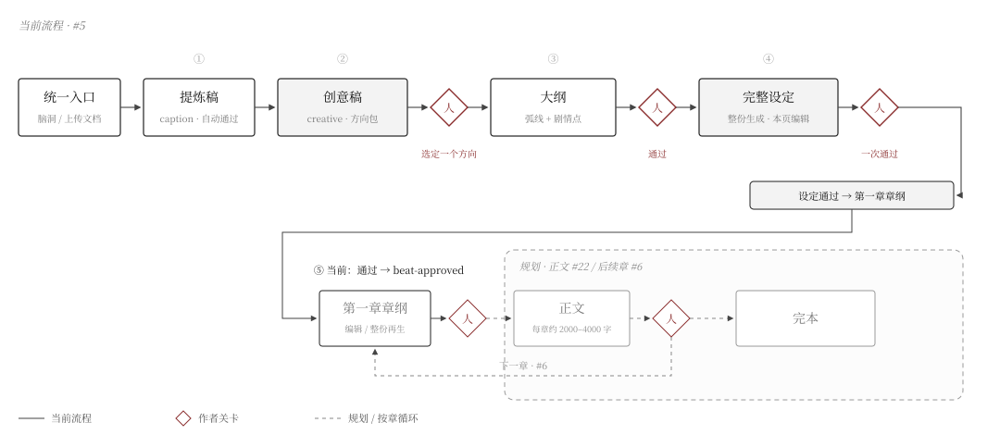
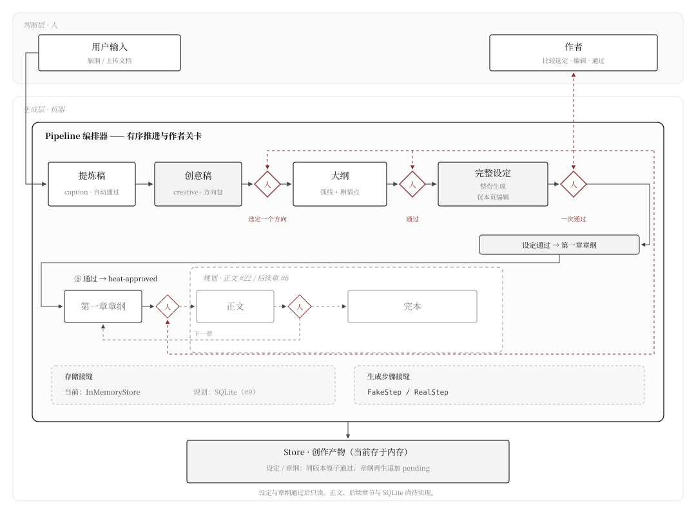

<p align="center">
  
</p>

<h1 align="center">agent4novel</h1>

<p align="center">
  <strong>从一句话脑洞，到一部完本长篇。</strong>
</p>

<p align="center">
  <a href="#快速开始">快速开始</a> ·
  <a href="#它是怎么工作的">流水线</a> ·
  <a href="#架构">架构</a> ·
  <a href="#文档">文档</a> ·
  <a href="#路线图">路线图</a> ·
  <a href="./README.md">English</a>
</p>

<p align="center">
  <a href="./LICENSE"></a>
  <a href="#快速开始"></a>
  
</p>

---

小说创作长期是手工作坊式的活计：一个作者，一支笔，几十万字一点点磨。agent4novel 想把它搬进一条现代流水线——AI 像一支随叫随到的编辑团队，负责补设定、排大纲、写正文；你是唯一的主编：故事方向你定，每道关卡你审。混沌的灵感进去，结构严谨的长篇出来。

它面向「有想法但没受过写作训练」的作者。你给它一句话脑洞（或一份设定文档），它先反过来问你几个关键问题，然后一环一环地生成：卖点与梗概、全书大纲、每章的章纲、每章的正文。工具完全在本地运行，单用户、开源，数据不出你自己的电脑。

## 快速开始

```bash
pnpm install
pnpm dev        # server :8787 + web :5173
```

打开 <http://localhost:5173>。不配 API key 也能跑：此时是演示模式，由内置 fake 生成示例内容，不会调用真实模型。

接真实模型（目前支持 DeepSeek）：

```bash
export DEEPSEEK_API_KEY=sk-...
pnpm dev
```

## 它是怎么工作的

<p align="center">
  
</p>
<p align="center"><sub>图 1 · 流水线与关卡：方框为 agent 步骤 / 产物，菱形「审」为人工关卡，虚线为按章循环</sub></p>

预处理先和你确认故事方向；之后每一章都先出章纲、你点头、再写正文、你再过目。产物没通过，流水线绝不继续。

## 架构

整条架构只围绕一个理念：**human-in-the-loop**——机器负责生成，人负责判断，两层之间唯一的通道是关卡：AI 写出的东西，不过关卡就不算数。

<p align="center">
  
</p>
<p align="center"><sub>图 2 · human-in-the-loop 分层架构：判断层（人）在上，生成层（机器）在下；Pipeline 拥有全部流程控制权，关卡是两层唯一的通道</sub></p>

- **编排器（Pipeline）**：按固定顺序驱动步骤链，用状态机（ready → awaiting-interview / awaiting-approval → complete，由产物状态推导）强制关卡——AI 产出一律 pending，作者通过或编辑保存后才解锁下一步。顺序、关卡、持久化逻辑全部收在这一个模块。
- **步骤（Step）**：每个环节是一次受契约约束的 AI 生成：`runStep` 对输入输出做双向 zod 校验；提示词维护在 SKILL.md 文件里，调 prompt 不用改代码。步骤不感知自己在流水线中的位置，因此可独立测试、独立替换。
- **产物（Artifact）**：产出按「作品 + 类型 + 章节」归档为 append-only 版本链（`{kind, chapter?, version, content, humanStatus}`），任何历史版本可回读；人工编辑保存即通过，AI 产出待把关。
- **可替换点**：存储（内存版开箱即用 ↔ SQLite 持久化，#9）与模型（AI SDK `createProviderRegistry`，换厂商 = 换字符串前缀，代码不感知 key）是两个注入点；测试用 FakeStep 跑全链路，从不触网。

## 技术栈

<p align="center">
  
  
  
  
  
  
  
</p>

<p align="center">Vercel AI SDK v7（<code>@ai-sdk/deepseek</code>）· pnpm workspaces · TypeScript 全链</p>

```bash
pnpm test        # 单元测试（全 fake，不联网）
pnpm typecheck
pnpm build
```

## 文档

这个仓库的文档是写给 agent 读的一等公民，人读也够用：

| 文档 | 管什么 |
|---|---|
| [CONTEXT.md](./CONTEXT.md) | 领域词汇表（先读它） |
| [docs/schema.md](./docs/schema.md) | 数据模型的唯一来源 |
| [docs/adr/](./docs/adr/) | 不可逆决策（编排、存储、skill 文件） |
| [docs/wiki/](./docs/wiki/) | 每张票的技术方案与状态记录（怎么做只看这里） |
| [docs/research/](./docs/research/) | 选型调研（技术栈、LLM provider 策略） |
| [docs/handoff.md](./docs/handoff.md) | 会话接力快照（当前进展与下一步） |

## 开发流程

每张 ticket 走同一个 loop：grill 对齐 → wiki 技术方案 → TDD 红绿切片 → 三轮自校准 → 双轴 code review。详见 [docs/wiki/README.md](./docs/wiki/README.md)。

## 路线图

| 票 | 内容 | 状态 |
|---|---|---|
| [#2](https://github.com/12bitsD/agent4novel/issues/2) | 脚手架 + 存储 + pipeline 骨架 + 书架 | ✅ |
| [#3](https://github.com/12bitsD/agent4novel/issues/3) | 统一入口 + 创作界面 idea 状态（人工链路） | ✅ |
| [#10](https://github.com/12bitsD/agent4novel/issues/10) | 预处理 RealStep + interview + outline/setting 形态定案 | ✅ |
| [#11](https://github.com/12bitsD/agent4novel/issues/11) | 预处理重构：提炼稿 + 创意稿方向包 + 比较视图 | ◀ 下一个 |
| [#4](https://github.com/12bitsD/agent4novel/issues/4) | 大纲生成 | |
| [#13](https://github.com/12bitsD/agent4novel/issues/13) | 设定完整版生成 | |
| [#9](https://github.com/12bitsD/agent4novel/issues/9) | SQLite 持久化（提前到 #5 前：正文产出必须扛得住重启） | |
| [#5](https://github.com/12bitsD/agent4novel/issues/5) | 章纲/正文关卡 | |
| [#6](https://github.com/12bitsD/agent4novel/issues/6) | 续写 + 作品详情 + router | |
| [#7](https://github.com/12bitsD/agent4novel/issues/7) | Agent 配置（文风/题材/爽点） | |
| [#8](https://github.com/12bitsD/agent4novel/issues/8) | 坏例收集 | |

---

<p align="center">
  <sub><a href="./LICENSE">MIT License</a></sub><br>
  <sub>如果这个项目对你有意思，欢迎 star，或来 issue 聊聊。</sub>
</p>
