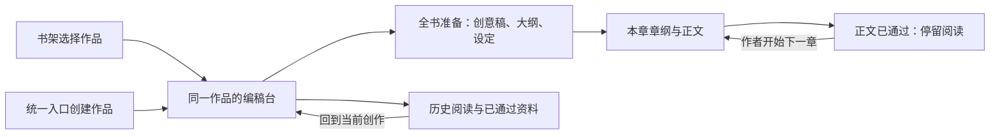
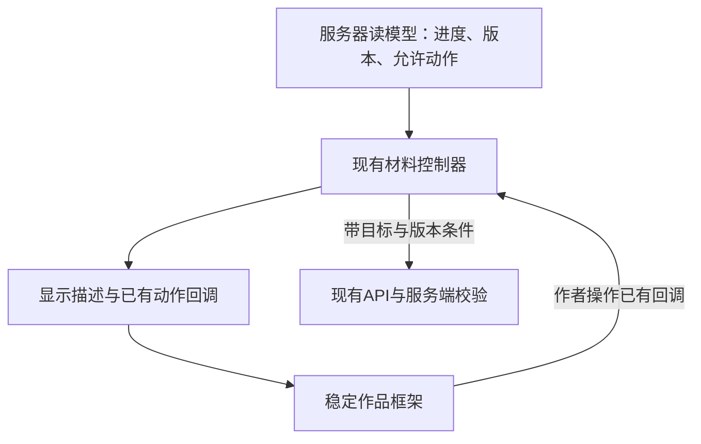

# 作者的编稿台：一致交互方案

研究日期：2026-10-04。源码基线：main `5ba9fe38062120231d42b8b64a8fc4b5e3cd1e23`。本文件是开发前候选方案，配套[第一方资料](./author-workbench-interaction-sources.md)。已核对源码与现有测试入口，未实现方案、未升级依赖、未执行新的产品端到端验收。

2026-10-06补充：用户要求防遗漏核查；逐项改造位置、接口影响、测试、文档及工作包统一见[全量核查与详细改造方案](../plans/author-workbench-renovation.md)。本页保留路线比较和概念依据，不重复维护全部实施清单。

用户认可“作者的编稿台”方向并要求研究方案。已确认的是研究方向；下文推荐的具体结构、动作位置和实施范围仍是方案，不把“可以，研究下方案吧”扩成开发、提交或发布授权。研究保存在本地 `codex/author-workbench-design` 分支，未创建、关闭或变更 ticket。

## 1. 结论与范围

推荐组合：**稳定作品框架＋产物适配层＋局部 CSS 动效**。

设计概念是：**作品一直在桌上，AI递交下一份内容，作者负责修改、把关和决定何时继续。** “编稿台”是体验概念，领域词仍沿用[CONTEXT](../../CONTEXT.md)中的作品、统一入口、创作界面、关卡、章纲和正文。

这轮应统一四件事：作品身份与位置、材料的展示层级、真实状态和行动位置、从一份材料到下一份的交接。保留 BC 黑白灰、宋体正文、无衬线界面和像素品牌；沿用[Wiki035](../wiki/035-frontend-design.md)的方向及[Wiki047](../wiki/047-reading-layout-refinement.md)的排版边界，保存其原决定和冻结审核记录。

首期以现有业务规则为边界。只在同一显示框架中解释这些规则，不统一成所有节点自动保存，不增加通过后编辑设定/章纲，不增加流式生成、自动续章、全书完成百分比、Wiki检索或 Agent 工具执行。后两项继续归 #28/#29；#46 存储初始化竞争不在本方案内。

可直接复用现有后端的主体包括作品进入、创建后的创作界面、按章阅读、当前关卡、合法动作和已通过资料。书架显示具体待办、创建结果精确核对、大纲通过绑定可见版本各有独立契约缺口，不能用界面文案补成已存在的能力。

## 2. 现有基础与需要保留的边界

[App](../../apps/web/src/App.tsx)在书架、统一入口、创作界面之间替换内容，共用品牌和主题。进入作品后，[Workspace](../../apps/web/src/pages/Workspace.tsx)持有章级会话、版本条件、操作锁和恢复逻辑。它是现有协调者，新的外壳不另建一套业务流程。

[WorkView](../../packages/contracts/src/artifacts.ts)同快照提供 `currentChapter`、`chapters`、`workflowState`、`nextStepId`、`allowedActions`。作者的阅读目标与服务器的当前工作章分别表达。读旧章不会推进工作；打开作品也不会自动调用模型。

保存规则目前确有差异：

| 材料 | 当前行为 | 适配时必须表达的事实 |
| --- | --- | --- |
| 提炼稿 | 自动通过，只读参阅 | 没有作者通过按钮 |
| 创意稿 | 显式保存全部方向；选定时提交单方向，通过后只读 | 保存编辑与选定方向是不同动作 |
| 大纲 | 显式保存待通过内容，通过后只读 | 保存未通过；通过前处理本页编辑 |
| 设定 | 编辑仅在本页，通过时提交可见全文并定稿 | 没有独立草稿保存，不能提前显示“已保存修改” |
| 章纲 | 编辑/意见在本页；通过或整份再生；通过后只读 | 通过并生成正文应明示两个结果 |
| 正文 | 600ms自动保存；通过与整章重写分开；已通过正文可编辑且保持通过 | 保存反馈跟随真实响应；通过后等待作者开始下一章 |

对应入口为[CreativePoster](../../apps/web/src/pages/CreativePoster.tsx)、[OutlineReview](../../apps/web/src/pages/OutlineReview.tsx)、[SettingReview](../../apps/web/src/pages/SettingReview.tsx)、[BeatReview](../../apps/web/src/pages/BeatReview.tsx)、[ProseReview](../../apps/web/src/pages/ProseReview.tsx)。本页将规则归纳为设计约束，没有移动这些规则的权威归属。

创意稿、大纲的本页编辑尚未纳入 Workspace 的统一离开判断；手动保存也没有正文式冻结请求对账。若新增任意材料切换入口，就必须先补相应保护，不能因为“只是换个视图”而卸载未保存内容。

## 3. 页面组织的三条可行路线

| 路线 | 机制与效果 | 收益与代价 | 适用条件 |
| --- | --- | --- | --- |
| A：公共组件逐页统一 | 各页面继续拥有布局，复用身份栏、状态、动作、恢复提示 | 迁移较小，能逐步改善全流程；以后仍要逐页维护相对位置与交接 | 优先降低单次改动，接受分阶段收敛 |
| B：稳定作品框架＋产物适配层 | 作品身份、导航、稿面、操作与参考位置由同一框架组织；每种产物提供显示描述与动作槽 | 连贯感更直接，新增材料可复用；需要验证组件身份、草稿保护和旧回调隔离 | 当前推荐，既有控制器成熟且可继续复用 |
| C：集中交互状态机 | 统一管理阅读目标、导航确认、编辑保活和操作生命周期，组合现有节点控制器 | 能支持更复杂的多材料协作；事件与目标身份迁移较大，回归范围广 | 日后需要多份材料同时编辑、统一恢复中心时再评估 |

选择 B，并先用 A 的公共组件完成迁移。C仍保留服务器对工作进度和权限的权威，不是另写后端工作流；当前没有足够理由把这次视觉与交接优化绑定到该迁移。

## 4. 用户路径与职责交接

### 4.1 进入与创建：从素材到有身份的作品

作者在书架打开作品，或在统一入口输入脑洞/上传文档。创建前的素材没有作品ID，界面应如实表达为本页输入。收到创建成功后，以服务器作品ID与标题进入稳定框架；模型生成继续由创作界面的显式动作触发，沿用现有行为。

候选一是保持独立输入页面、创建后进入框架；候选二是将未创建输入也嵌入编稿台外观。推荐第二种视觉关系，但继续保留独立创建请求和输入控制器：同一稿面承载素材，创建成功后身份区就位，内容区进入下一阶段。不能在创建前展示虚构版本、保存成功或生成进度。

新增前端工作包括未提交素材的离开保护，以及读取中/空书架/读取失败的明确区分。当前 [Entry](../../apps/web/src/pages/Entry.tsx)返回直接离开，本页素材和标题会被卸载；[Bookcase](../../apps/web/src/pages/Bookcase.tsx)在请求完成前以空数组初始化，缺显式读取状态。这些属于应先验证的现有缺口。

创建结果未知还没有稳定操作身份。首期必须保留输入、如实说明不确定，不能把再发同一 POST 包装为安全重试。精确核对与防重复创建需要另行定义幂等键/结果查询，不能依作品同名或同脑洞猜测。

### 4.2 全书准备：同一稿面承载不同材料

候选一是保留各页结构并只共用页头；候选二是共用材料框架、保留内容编辑器。推荐第二种：创意稿仍能比较方向，大纲仍按弧线/剧情点编辑，设定仍按卡片组织。外层身份、状态、动作和参考的角色稳定，内容形态随材料变化。

全书准备导航反映真实产物状态；提炼稿是参阅材料，不增加新关卡。已通过材料从同一入口只读回看，未生成项不可点击后暗中启动模型。切出有本页编辑的材料前，先由其控制器判断能否保存、提交、取消或明确放弃。

创意稿选定、大纲通过和设定通过后的自动衔接沿用当前 Workspace 行为。动作文案要说明真实结果，例如“选定方向并生成大纲”，后续生成失败时分别显示上一步已通过与下一步未完成，不能把通过也回滚成失败。

### 4.3 按章写作：工作目标和阅读目标保持独立

章纲和正文共用同一材料框架。章纲通过后开始正文生成；新正文确认可用后替换稿面，等待期间原章纲保持可见。正文通过后停留阅读，主行动改为开始下一章；不借动效或路由自动推进。

历史章显示阅读目标，同时保留当前工作章标识和返回入口。历史正文按既有规则可编辑，保存保持通过状态；后续章节保留并提示检查衔接。历史阅读的主行动不能从阅读章号推算下一次生成目标。

候选一是阅读和工作共享同一个选择值，候选二是明确分开两个目标。第一种仅适合严格线性向导，本产品允许回看和修改，推荐第二种并复用当前实现。

### 4.4 参考与配置：随手查看，不重建写作会话

候选一是展开时创建、关闭时卸载面板；候选二是首次打开后保留必要组件身份，仅改变可见性。对于有编辑或未知操作的配置，推荐沿用现有 `hidden` 保活和导航保护；纯只读参考可按需渲染，不一次保活全书所有内容。

资料显示当前材料可依赖的已通过内容；配置明确作用于未来生成。设定检索工具和书级Wiki尚未实现，不在辅助区装饰成可用入口。折叠、主题变化和动效不得触发保存、生成或重新读取后覆盖输入。

## 5. 稳定框架如何与现有能力连接

推荐三个前端职责，名称是方案示意，不是新增后端注入接缝：

- **作品框架**：接收作品身份、阅读/工作目标、材料槽、行动槽、状态与辅助槽，只组织显示。
- **产物适配层**：把现有控制器的真实状态和允许动作翻译为一致的页头、保存提示、主次行动和恢复控制；差异不能丢失。
- **既有控制器**：继续执行API、校验版本、冻结输入、自动保存、阻止迟到响应、协调通过后的生成以及决定是否可离开。

显示描述至少区分材料身份/版本、阅读目标、工作目标、是否通过、保存策略、操作状态、主次动作及可用恢复动作。外壳不得凭材料类型自行拼请求、推断下一章、自动核对或自动重试。

作品框架放在章级会话外，以作品ID维持稳定身份，不跟随 WorkSession 的章节key重建。章级控制器继续按作品和章节保持原隔离，同一章内切主题或展开资料不更换控制器；正常保存导致版本变化也不应重挂载编辑器。异步回调仍检查原目标与序列，不能让上一章结果更新新章稿面。正文保留单纯文本与原换行，不为印刷效果拆段落、加字或改变UTF-16选段依据。

## 6. 行动和状态的统一表达

建议把材料主行动与保存状态统一放在**稿面页头**，承接当前正文的布局。长文只让紧凑行动行保持可达，不把多层顶栏都固定。小屏允许换行并保持44px常用控制；不增加一套重复主按钮，也不通过新增身份栏把正文首行继续推后。

底部常驻操作条也可行，更贴近长表单结束位置，但会改变当前正文的阅读习惯并增加窄屏遮挡验证。首期推荐页头；前轮流程示意中的底部操作只用于解释交接，不作为动作位置已获批准的依据。

统一的是含义与可预测位置，具体按钮由真实保存策略决定：

| 状态 | 应表达 | 主行动边界 |
| --- | --- | --- |
| 编辑未保存 | 本页有编辑；自动保存、显式保存或通过时保存的区别 | 只显示当前材料确实支持的动作 |
| 保存中 | 已发出保存操作，仍保留文字 | 不能把受理或动画结束写成已保存 |
| 已保存、待把关 | 当前版本已落库，尚未成为通过的依据 | 按该产物已有条件选定/通过；大纲的可见版本绑定需先补契约 |
| 已通过 | 通过结果已确认，可供下游使用 | 已通过正文允许编辑，其余上游材料只读 |
| 生成中 | 哪份材料正在生成，哪些原内容仍保留 | 不增加模型内部虚构步骤、百分比或逐字输出 |
| 明确失败 | 哪步失败、哪些结果已经成功、合法恢复动作 | 已知失败按现有条件重试 |
| 结果未确认 | 请求可能已生效，输入和原请求仍保留 | 只使用该控制器实际具备的核对/原请求恢复能力 |

恢复提示可以共用版式，不能生成万能“重试”按钮。正文、章纲、续章的冻结恢复可复用；创意稿、大纲和创建流程的能力缺口必须单列。

## 7. 动效路线与视觉标记

| 路线 | 机制 | 推荐与验证条件 |
| --- | --- | --- |
| M1：局部CSS | 稿面小范围淡入/位移，参考区就近展开，真实状态文字轻量更新 | 首期推荐，无新依赖；关闭动效后仍能完成操作 |
| M2：M1＋浏览器原生视图过渡 | 功能检测后为作品身份等已允许导航增加共享元素快照 | 后置小验证；不支持或失败时执行同一视图更新，不重复业务请求 |
| M3：升级React后使用框架过渡 | 新版本协调指定视图边界，替代同一边界的手工原生协调 | 独立升级范围，不与本轮控制器迁移捆绑 |

项目实际React为19.2.8，包导出验证中 `ViewTransition` 不存在。官方19.3现已稳定提供该能力，资料单核对了发布与API，但不代表本项目已能直接使用。`Activity`虽然已存在，其隐藏行为会清理Effects，也不能直接替换有自动保存/核对任务的现有隐藏方式。[资料](./author-workbench-interaction-sources.md)

固定三类视觉语义：**换材料、展开参考、确认通过**。作品身份和操作位置保持稳定，动画仅解释确认后的视图变化；长请求不把整页锁在过渡里。减少动效偏好下关闭位移和共享元素过渡，保留结果文字、边界和焦点提示。

“页沿、边注、通过后的留痕”作为统一记号。保存反馈安静更新；通过以真实状态变化表现，不加入庆祝效果、仿模型思考旁白或全书进度。首期保持047字体与阅读轴，优先验证跨页面连续性。

## 8. 已识别缺口与分期

| 缺口 | 已确认事实/限制 | 推荐归属 |
| --- | --- | --- |
| 创建前素材离开 | Entry本地输入无脏离开保护 | 首期前端补保护；不会自动生成 |
| 新材料导航 | 创意/大纲编辑未接入Workspace脏汇总 | 在开放任意材料切换前补guard；取消时完整保留输入 |
| 书架读取 | 请求未完成前可能显示暂无作品 | 首期区分读取、真实空态和失败 |
| 书架具体待办 | WorkSummary只有id/title/seedPreview/chapterCount | 首期可沿用“继续写作”；详细待办需服务端摘要新增字段 |
| 创建结果未知 | 没有稳定创建操作ID/精确查询 | 单独契约设计；首期保留输入、如实提示，不假称安全重试 |
| 创意/大纲保存未知 | 没有正文式冻结提交对账 | 适配层如实显示当前能力；完整统一恢复另行实现 |
| 大纲可见版本通过 | 通用approve请求没有expectedHeadVersion | 若承诺绑定可见版本，应同步补版本条件与CLI/兼容验收 |
| 统一所有编辑自动保存 | 目前各产物策略不同 | 产品行为扩展，后续单独对齐与设计，不因换壳静默加入 |

书架详细待办的两条可行路线是逐卡读详情和扩展服务端摘要。前者会增加N+1请求，后者需要共享契约/API/两个Store的投影测试。长期推荐摘要新增 `currentChapter/workflowState/nextStepId`，由服务器计算；不用完成章数推断待办，也不编造最近保存时间。

## 9. 建议实施顺序

| 阶段 | 开发与产物 | 退出条件 |
| --- | --- | --- |
| P0 风险验证 | 用一个现有正文控制器挂入新框架，验证保活、选段、折叠、焦点与关闭动效；定义适配描述 | UI变化不重建编辑、不增加请求、不改变文本/版本；否则先修框架边界 |
| P1 最小贯通 | 书架→统一入口→创建成功→沿用现有全书准备流程→章纲→正文→通过停留→作者开始下一章；共用身份、状态和行动位置 | 同一作品和工作目标连续；创建前离开、真实空态保护可演示；沿用既有前置资料 |
| P2 全部材料 | 接入创意稿、大纲、设定、资料及配置；补新导航所需的dirty/locked汇总；检验通过后的自动衔接 | 六类材料真实规则一致表达；没有虚构保存/核对按钮；历史阅读与工作目标分离 |
| P3 异常与完整验收 | 保留/核对/重试/版本冲突/迟到结果/刷新恢复，两章贯通与亮暗/窄宽/减少动效 | 原保护全部回归，实际浏览器确认无输入或选段损失，未确认状态不能被布局遮蔽 |
| 后置增强 | 原生共享元素、书架详细待办、创建幂等与全站编辑持久化按独立范围评估 | 每项有对应契约/实测；未通过时维持首期可用路线 |

保护验证贯穿每个阶段：P0/P1/P2每开放一个新切换入口，都先证明对应未保存/锁定、未知请求与迟到回调规则保持；P3负责完整贯通与回归，不能把首次保护验证推迟到P3。先验证状态保留，再做连续稿与迁移。详细原型至少覆盖书架进入、素材创建、关卡交接和历史回看；使用演示数据，标明模拟，不用效果稿冒充已上线界面。排期按阶段退出条件推进，不给未经评估的工期承诺。

## 10. 统一验收建议

- 正常路径：同一脑洞创建作品，走完创意稿、大纲、设定和两章双关卡；每次结果与下一步能解释，正文通过不会自动生成下一章。
- 阅读位置：正在推进第二章时回看/编辑第一章；返回仍是第二章的真实状态，保存仍遵守原规则，后章衔接提示保留。
- 未保存内容：创意/大纲/设定/章纲/正文/配置及创建前素材分别验证；展开、主题、动效不丢输入；离开按实际保存策略处理。
- 未知与迟到：保存/通过/续章响应丢失、409版本冲突、快速连点、旧章迟到响应；不能重复写入、错误推进或覆盖新目标。
- 通过版本：大纲若新增可见版本条件，用另一客户端修改后再通过的场景证明被拒绝；没有该证据就不声称已保证。
- 原文与选段：同一正文在迁移前后逐字、换行、字符数、UTF-16偏移相同；坏例快照与批准状态不因布局变化。
- 可见性：320/375/768/890/1024/1440px亮暗，长短章、长标签、错误、参考和配置；主内容可辨、无横向溢出和操作遮挡。相同047演示内容不因重复身份/固定栏延后正文首屏。
- 动效关闭：即时完成同一视图更新，状态仍可读，键盘可找到合法动作，焦点不被成功通知夺走。
- 刷新与重启：已落库内容/状态恢复，未提交素材和本页意见只承诺当前已实现的范围；不恢复或重放仍在运行的模型调用。

这些是未来实现的验收场景，不是此次通过结果。现有测试入口包括 Workspace 的 continuation/config-navigation/autosave 系列、EntryPages.accessibility、ProseReview.bad-examples；新增框架应补有效RED→GREEN并执行仓库完成审核，不能沿用047的857项当新版本证据。

## 11. 决定状态与下一步

| 点 | 状态 | 来源/下一步 |
| --- | --- | --- |
| 作者的编稿台、作品主角与作者把关 | 已认可研究方向 | 用户本轮“可以，研究下方案吧”；不扩大为实施批准 |
| BC黑白灰与047阅读参数 | 保留已定约束 | 035/047与原Human决定 |
| 保存/通过分开、工作/阅读分开、正文后显式下一章 | 保留业务语义 | CONTEXT、WorkView与现有控制器 |
| 页面B＋动效M1；迁移时复用A组件 | Agent推荐已收敛 | 成本、连续性与现有保护综合判断，待方案审阅/实现验证 |
| 页头行动、参考保活与Guard接入 | Agent推荐 | 普通交互细节先按推荐；用连续原型验证可达性 |
| 所有材料自动保存、创建幂等、详细待办 | 后续独立范围 | 不能当本轮界面改造附带能力；开发时分别对齐 |
| 资料/源码事实 | 已核对 | 第一方资料、当前包导出及下面代码入口 |
| 新框架正确性、体验和跨浏览器效果 | 待验证 | P0–P3，无新产品端到端或用户体验通过结论 |

下一次授权开发时，把选定范围写入正式ticket并按完成审核清单执行；本研究不关闭实现票。现阶段不需重新选择字体、色值或动效时长，真正范围变化留在上表。

## 12. 源码与证据入口

- [App](../../apps/web/src/App.tsx)：初始URL、三类页面与共用壳；[Workspace](../../apps/web/src/pages/Workspace.tsx)：`WorkNavigation/WorkSession`、`continueAfterApproval`、`continueAfterBeat`、脏与锁定导航、章级序列、自动保存、续章冻结、配置保活。
- [WorkSummary请求/响应](../../packages/contracts/src/work-requests.ts)：当前书架字段、创建请求、创意/大纲保存版本条件和通用approve；[WorkView](../../packages/contracts/src/artifacts.ts)：工作进度、章摘要与权限。
- [Entry](../../apps/web/src/pages/Entry.tsx)、[Bookcase](../../apps/web/src/pages/Bookcase.tsx)：本页输入、创建/打开、读取和卡片数据；[API](../../apps/web/src/api.ts)：客户端调用与共享校验。
- [正文行为](../../apps/web/src/pages/ProseReview.tsx)、[配置导航测试](../../apps/web/src/pages/Workspace.config-navigation.test.tsx)、[续章测试](../../apps/web/src/pages/Workspace.continuation.test.tsx)、[自动保存测试](../../apps/web/src/pages/Workspace.autosave.test.tsx)、[入口测试](../../apps/web/src/pages/EntryPages.accessibility.test.tsx)。本次读了测试定义，未重新运行产品测试。
- 本轮实际包导出检查：web目录内 `import * as React from 'react'` 得到19.2.8、ViewTransition undefined、Activity symbol、startTransition function。此证据只说明当前模块能力，不能替代动画或端到端实测。
- [第一方资料单](./author-workbench-interaction-sources.md)包含React、MDN、W3C与Scrivener来源及其适用边界。最新资料与实际依赖版本分别核验，不凭示例推导当前已实现能力。

独立可行性复核已完成。复核确认三条结构路线可行，并建议同步限定大纲的公共动作承诺、将稳定框架置于章级会话外、把切换保护验证前置；以上已纳入正文。该复核是研究方案检查，不替代未来实现的独立双轴审核或端到端验收。
