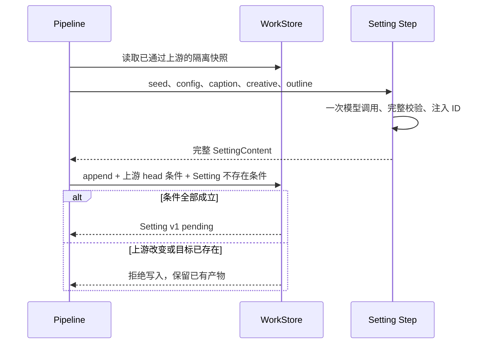

# 013 — 完整设定生成与一次通过

## Agent Context

- **读取时机**：实现 #13、修改设定形态／编辑／通过语义，或确定后续生成如何消费设定时。
- **原始目的**：把创意稿中的设定要点扩展成作品基准，经作者把关后供章纲与正文消费；范围与 AC 以 [issue #13](https://github.com/12bitsD/agent4novel/issues/13) 为准。
- **实际落地**：生产链为 caption → creative → outline → setting；生成 pending、页内编辑、专用命令同版本原子通过、approved 只读已实现。2026-09-05 按技术方案完成 TDD 切片，交付门禁状态见“完成审核证据”，不以技术评审代替功能验证。
- **当前价值**：本页拥有设定生成与一次通过的工程 HOW；先读“原子写入与快照隔离”“提交结果确认”，再沿“代码落点”和测试矩阵核对。内容与公开协议归 [schema](../schema.md#setting13-已确认设计)，代码执行定义归 contracts。
- **后续变化**：通过后修改归 [#17](https://github.com/12bitsD/agent4novel/issues/17)，冲突澄清归 [#18](https://github.com/12bitsD/agent4novel/issues/18)，全仓契约治理归 [#19](https://github.com/12bitsD/agent4novel/issues/19)；#9 负责真实 SQLite，#5 负责章纲／正文，#15 负责后续 Hono RPC 迁移。
- **代码入口**：[内容契约](../../packages/contracts/src/setting.ts)、[结果对账](../../packages/contracts/src/setting-submission.ts)、[完成命令](../../apps/server/src/setting-review.ts)、[store](../../apps/server/src/store/work-store.ts)、[Web 状态](../../apps/web/src/setting-review.ts)、[工作台](../../apps/web/src/pages/Workspace.tsx)。

## 设计目的

设定是 Agent 与作者共同整理的作品基准。结构保证总览、世界和人物的最低完整性，具体内容粒度和创作品质交给 Agent 生成与作者把关。

作者的主要动作是“看完、修改、通过”。#13 将内容提交与通过合成一次操作，避免要求作者理解草稿保存与版本追加；通过后的内容保持稳定，章节生成不自动改写它。

## 起始上下文

固定点为 `26b3164114f10f193c8a38d7bafa2f1473505f62`；设计整理开始时 `main` 工作区干净。#13 是 OPEN、`ready-for-agent`、Project Backlog，未进入实现或交付。

- [Wiki 004](./004-outline-arcs-segments.md) 提供已通过的大纲及人工关卡；其“保存草稿再通过”流程只说明 Outline 的现状，不作为 Setting 的保存规则。
- [Wiki 011](./011-caption-creative-directions.md) 提供提炼稿、选定的单方向创意稿及 `consumes` 守卫。Setting 在这两者和已通过大纲之后生成，原始 `seed` 仍是输入。
- [Wiki 014](./014-agent-cli-telemetry.md) 与 [Wiki 016](./016-model-runtime-provider-config.md) 提供 CLI、遥测、模型调用和手动失败重试机制。

开工时仅有 `Work + Artifact` 和 `InMemoryStore`；本票保留此存储结构。旧 Setting 占位字段已被本票替换，没有独立的 setting SQL 表或 materials 表；SQLite 的架构方向仍遵循 [ADR-0002](../adr/0002-storage-sqlite-skills-as-files.md)。

## 技术方案

### 方案决策与模块职责

本方案沿用 store 与 Step 两个现有 seam：内存／SQLite adapter 负责存储一致性，fake／真实 Step 负责生成替换。设定通过逻辑放在一个小 interface 的领域 module 中；不让 HTTP、Web 和 CLI 各自拼装提交步骤。

| Module | Interface 与责任 | 不应承担 |
|---|---|---|
| contracts | Setting 三种内容边界、公开请求／响应、规范化及提交结果比较 | 数据库写入、模型调用、浏览器状态 |
| Setting Step | `runStep` 输入完整上游，输出带服务端 ID 的完整内容 | 写库、批准、分栏目模型调度 |
| Setting 通过 module | `approveSetting(store, workId, request)`：身份校验、候选准备、调用原子写入 | 通用事务框架、LLM 修复 |
| WorkStore | 条件检查、快照隔离、append／finalize 单次提交 | Markdown 解析、人物语义质量 |
| Pipeline／读模型 | 上游快照、关卡顺序、可用操作、下一步骤 | 用户草稿、UI 组件状态 |
| Web review module | reducer、临时键、草稿／提交快照、导航保护 | 推导或绕过服务端关卡 |
| CLI | 同一公开协议、一次调用内的结果确认、smoke | 第二套通过规则或模型调用入口 |

依赖分类决定测试方式：Zod、ID 集合与 reducer 为进程内计算；存储沿用已有可替换 adapter；Web／CLI 的 HTTP 传输可由现有 fetch 测试替身替换；第三方模型只在 Step 测试中 mock。正式代码评审以这些 interface 的可观察行为为测试面。

对原子完成接口并行比较了三种候选，选 A 作为实现基线：

| 候选 | 能力与代价 | 裁决 |
|---|---|---|
| A. 条件写入＋回读确认 | Store 只接受已准备的完整候选，检查 head／pending 后提交；客户端以基线和提交快照对账 | 采用；不增加持久元数据，兼容未来 SQLite 条件事务 |
| B. 回调事务＋提交回执 | Store 锁内运行同步回调，以 key／hash 重放第一次结果 | 延期；需回调重入约束、回执持久化与保留策略 |
| C. Store 专用 approveSetting＋等价重放 | 普通调用简单，重复内容可直接 200；但存储需理解 Setting 结构与等价规则 | 不采用；领域逻辑进入 adapter，且无原 pending 基线时可能混淆同文旧卡与新卡身份 |

### 契约、规范化与身份

形状与 DTO 的单源是 [schema 的 #13 设计](../schema.md#setting13-已确认设计)。实现按 `SettingDraft`（模型无 ID）→ `SettingContent`（服务端 ID 完整）→ `SettingReviewDraft`（仅新增项缺 ID）→ `SettingContent` 贯通；三者共享字段及数量规则，不各写一份 Zod。

服务端解析请求后收集当前设定全部 `itemId` 与 `sectionId`。已有 itemId 在全设定内查归属，所以跨栏目合法；sectionId 只能作为栏目 ID。重复、跨类型冒用、外来 ID 返回带路径的 422；省略 ID 表示新建，空字符串和 null 不等于省略。

生成阶段与通过阶段的新 ID 使用服务端 `crypto.randomUUID()`，分别加卡片／栏目类型前缀，检查本候选与原基线中不重复。不要复用 Outline 逐项扫描原数组的 max+1 逻辑：批量新增时可能得到相同编号。已有 ID 不因文本或顺序改变而重算。

只有纯文本标题去首尾空白；正文与总览保留 Markdown 原文，以 `trim()` 结果判断空值而不重写源文本。ID 注入与解析均生成新对象；禁止在 `getWork()` 返回树上就地加工。

### 原子写入与快照隔离

Store interface 增加 `finalizeArtifact`，并为既有 `appendArtifact` 增加可选前置条件。条件不作为持久谱系字段；它们只用于同一次提交的比较与写入。

```ts
type ArtifactPrecondition = {
  kind: ArtifactKind
  chapter?: number
  head: null | {
    artifactId: string
    version: number
    humanStatus: HumanStatus
  }
}

// 既有 append 的可选 opts 扩展；旧调用无需改变。
type AppendOptions = {
  chapter?: number
  preconditions?: readonly ArtifactPrecondition[]
}

finalizeArtifact(input: {
  workId: string
  kind: ArtifactKind
  chapter?: number
  expectedArtifactId: string
  expectedHeadVersion: number
  content: JsonValue
  preconditions?: readonly ArtifactPrecondition[]
}): Artifact
```

`head: null` 要求目标 bucket 不存在；非空 head 要求当前最新版的 ID、版本和状态全部匹配。finalize 自带目标必须 pending 的约束，不能由调用者指定任意目标状态。调用方不能设置 Artifact.id、version 或 createdAt；成功固定替换 content 并置 approved。

InMemoryStore 在一次同步调用中校验作品、kind／chapter、全部条件、目标 head；先完成输入复制、候选与返回快照准备，再通过一次内部记录替换发布结果。检查与替换之间不允许 await、回调或外部 I/O；之前抛错不改变任何产物。重复通过即使 expectedHeadVersion 仍相等，也因状态已 approved 被拒绝。

开工时 `getWork`、`createWork`、`appendArtifact` 暴露内部引用；现已统一保证“写入复制输入，读取和返回复制输出”。这属于新原子命令成立的必要前提：修改读到的 content/config 或保存前的输入对象，不得绕过命令修改存储。TypeScript Readonly 不能代替运行时隔离。

快照语义有一个必须兼容的调用方：旧 Creative select 依赖 append 返回对象在随后 setStatus 后同步变化。改为快照后，select 返回重新读取的已通过产物；测试继续要求响应为 approved。旧产物保存、版本递增和错误语义保持原有外部行为。

未来 #9 的 SQLite adapter 要在同一事务内读条件、更新目标并提交，目标更新行数必须为 1；不得在路由先检查、再无条件 UPDATE。共享 Store 测试届时复跑。本票没有 SQLite 实现、DDL、提交回执或重启耐久性证明。

### 生成、输入快照与提交

生产定义追加 Setting，`consumes = ['caption', 'creative', 'outline']`，`gateAfter = {kind:'setting'}`。Pipeline 从一次隔离的 Work 快照组装 seed、config、上游内容及 head 清单；创意稿仍须满足单方向消费守卫。



Step 的 schema 从共享内容约束派生，模型面不接受 ID。prompt 使用明确分隔的原始输入、提炼稿、选定方向和大纲；沿用 `truncateSeed` 的既有原始素材预算，结构化上游不静默截断。单次 `callLlm` 完整返回后注入 ID，再经 `runStep` 的输出校验。

生成成功不等于可直接写库。LLM 等待期间上游可能被其他页面编辑，因此 append 须在同一存储操作内验证三个上游仍为同一 approved head、Setting 仍不存在。上游不符返回 `upstream-changed`，不存旧输出，保留本次 telemetry；前置关卡未通过则先返回该关卡，通过后才可手动重试。

`Pipeline.runEntry` 可统一为声明 consumes 的步骤传入 head 条件，为输出传入“原先不存在”条件；串行正常路径不改变，新增测试覆盖竞态。仅在 await 前验证，或在 SQLite 事务外验证，均不足以证明落库对应有效输入。

模型或 schema 失败仍沿用手动整步重试；没有半成品、渐进输出、二次 LLM repair。Setting 显式向 SDK 传 `maxRetries: 0`，避免 SDK 默认重试绕过“一次调用”的本票要求；其他步骤的 SDK 默认行为不变。原始输入表达作者意图，提炼稿负责理解、创意稿提供方向、大纲提供安排；本票只检查版本／状态一致性，不识别语义矛盾或生成“待作者确认”栏目。

### HTTP 命令与错误

`POST /api/works/:workId/artifacts/setting/approve` 是唯一公开的 Setting 完成命令。路由先限制 body 大小和解析 JSON，再用共享请求 schema 校验；领域 module 读取隔离快照、确认当前可通过关卡为 Setting、验证 ID、准备最终内容，调用 Store finalize。

领域检查顺序为目标存在 → expectedHeadVersion 匹配 → 目标仍 pending → 前置关卡可通过 → 请求 ID 归属与最终候选。已通过目标先返回 `artifact-already-approved`，不能因重放时旧 ID 已被删除而误报 422。所有明确的 4xx 拒绝都发生在写入前；原子提交后构造或传输响应的异常只能视为结果未知，不能伪装为未写入。

最终存储条件包括目标 Artifact.id／version／pending，以及本次通过检查时三个上游的 approved head；任一条件在提交前变化都拒绝本次写入。这保证旧页面不能在上游退回 pending 时越过关卡。成功响应是完整的已通过 Setting Artifact，不再调用通用 `pipeline.approve()`，也不调用 advance。

通用 HTTP `/approve` 和 `Pipeline.approve(kind='setting')` 均返回 `setting-approval-required`；底层通用 setStatus 对 Setting 完全关闭，不论目标为 pending 还是 approved。Setting 的 pending 只由首次生成 append 创建，approved 只由 finalize 设置；禁止通过后退回 pending 再次完成同一版本。其他产物继续使用原有路径。

| HTTP／code | 含义 | 客户端处理 |
|---|---|---|
| 200／共享成功响应 | 原子写入完成，返回 approved 内容 | 验证响应及本次提交目标后进入只读 |
| 400 `bad-json`／`invalid-input` | JSON 或外层请求参数非法 | 保留草稿，显示请求错误 |
| 413 `payload-too-large` | 请求体超过技术上限 | 保留草稿，提示缩减 |
| 422 `invalid-content` | 栏目、文本或 ID 不合法，附 issues.path | 打开编辑模式并定位首个错误 |
| 404 `work-not-found`／`artifact-not-found` | 目标不存在 | 保留草稿，不自动重建作品或产物 |
| 409 `version-conflict` | head ID／版本或不存在条件不符 | 回读并保留本地内容 |
| 409 `artifact-already-approved` | 目标已通过，包含相同请求重放 | 按提交结果确认规则对账 |
| 409 `setting-gate-not-ready`／`upstream-changed` | 前置关卡未通过，或提交时上游 head 改变 | 保留草稿，提示先处理前置关卡 |
| 409 `setting-approval-required` | 使用通用通过入口绕过专用命令 | 提示正确入口，不改状态 |
| 500、网络异常、超时、非法成功响应 | 提交结果可能未知 | 不清草稿，冻结原提交并回读 |

错误保留现有 `code/message/retryable/attemptId` envelope，字段错误只传 `path/code/message`，不向客户端泄漏堆栈或整份内容。上述 HTTP 映射用于通过命令；`advance` 的步骤失败仍按现有协议返回 200 + `kind:'failed'`，不可混为一套状态码。

### 提交结果确认

本票保证同版本最多成功写一次，不承诺重复 HTTP 返回 200。Web 与 CLI 在本次提交周期保存三个隔离值：pending 基线 Artifact、规范化后的完整请求、当前编辑 revision；提交过程中冻结编辑。

首次成功响应也须验证，不只检查 `response.ok`。409、网络异常或响应解析失败时，自动回读一次 Work；后续不自动写入。先区分“本次明确拒绝且无未知旧写入”和“曾有结果未知的写入”，不能只根据最近一次响应或 GET 的 pending 状态作决定。

Web 的 Setting POST 初始 deadline 为 30 秒，结果确认 GET 为 10 秒，均覆盖 fetch 与响应体读取。封装层以 deadline 主动结束等待并触发 AbortController，不能依赖 fetch／测试替身自行响应 abort；迟到结果由请求序号隔离。超时只表示客户端停止等待，不代表服务端撤销。此改动限于 Setting 提交／确认调用，不改变模型生成的长请求预算。

共享纯函数 `matchesSettingSubmission(baseline, submitted, candidate)` 同时检查：

1. candidate 与基线的 workId、Artifact.id、version 相同，kind 为 setting，且内容合法、状态 approved。
2. 六字段、动态栏目、全部文本与数组顺序和 submitted 完全相同；标题按共同规则规范化，不比较渲染后文本。
3. submitted 携带的已有 ID 在同一位置逐项相等。
4. submitted 缺 ID 的新项在 candidate 中有合法唯一 ID，且该 ID 不属于 pending 基线的原 ID 集。

第 4 条防止把“另一页面保留了同文旧卡”误判为“本页删除旧卡再新建已经成功”。不允许简单移除所有 ID 后做 JSON 比较；本次提交的基线也不能被后台 GET 覆盖。

匹配表示作者提交的目标内容与身份要求已经达成，不证明一定是本次 HTTP 抢先写入；另一页面提交完全相同目标，也可以视为成功。candidate 为不同 approved 内容则进入冲突态并保留草稿；缺失目标或无法验证响应不得成功。

客户端在本次提交周期记录 `hasUnknownWrite`：任何 POST 网络异常、超时、5xx 或非法成功响应都置 true；此标记不能被之后一次明确拒绝或 pending 回读清除。有效的服务端 4xx 错误 envelope 才可证明该次请求未写入；没有未知旧写入时，它不应被泛化成“结果未知”。

| 已知事实 | 状态与恢复动作 |
|---|---|
| 无未知写入，400／413／422 明确拒绝 | 回到 editing，保留草稿；422 定位字段，可修改后重新通过 |
| 无未知写入，关卡或版本明确拒绝 | 进入 conflict 并回读；上游仍 pending 时保留草稿并显示前置关卡 |
| 无未知写入，回读确认原 Setting 仍 pending、id／version／content 与基线一致且 allowedActions 再次允许 approve | 提供“继续编辑”，恢复原草稿及编辑能力；下一次通过由用户触发，不自动提交 |
| 有未知写入，GET 仍 pending／失败，或重试明确被拒绝 | 仍为 uncertain，冻结原请求；只允许用户回读或重试同一请求，不能换内容／版本发送 |
| 任一情况下，读到可验证且匹配的 approved | 目标已达成，进入 approved，清草稿；未知写入也不能再覆盖该版本 |
| 任一情况下，读到可验证但不同的 approved，或无未知写入时目标基线已改变／不存在 | conflict，保留草稿；放弃并加载远端需明确确认，不自动合并或替换基线 |

`hasUnknownWrite` 的优先级高于最后一次 4xx。例如旧 POST 超时，重试又被关卡拒绝，不能据此解锁编辑，因为旧请求可能尚在处理。无未知写入时，关卡拒绝后的 GET 失败只表示当前关卡未知，保持 conflict 并允许再次回读；它不会凭空产生未知写入。

uncertain 下重试必须使用同一份冻结请求及 expectedHeadVersion，不能自动套用远端新版本。刷新／明确离开后原提交基线按产品决定丢弃，只展示当前服务器状态，不追认跨会话历史请求，也不承诺撤销在途请求。

### 服务端读模型与页面衔接

WorkView 增加 `nextStepId`，来源为 Pipeline.getState；页面用它选择“生成创意稿／大纲／设定”文案。caption 与 creative 都显示面向用户的“创意稿”；不再使用“creative 已通过就一定是在生成大纲”的旧判断。

| 服务端事实 | workflowState | nextStepId | allowedActions |
|---|---|---|---|
| 大纲待通过 | awaiting-outline-review | null | save-draft、approve |
| 大纲已通过，Setting 不存在 | ready-to-generate | setting | generate |
| Setting 生成失败且可重试 | failed | setting | generate |
| Setting 待把关 | awaiting-setting-review | null | approve |
| 四步定义已全部通过 | setting-approved | null | 空 |

不可重试失败不给 generate。生成中仍是页面局部 transient 状态；客户端不能从按钮状态推导后台任务已经结束。complete 的显示由定义末端关卡决定，保留以 Outline 结束的旧定义／测试，不把所有 complete 硬编码成 setting-approved。

大纲通过后采用现有 Creative 选定后的衔接方式，由该次用户动作的成功回调发起一次 advance。不得在每次 render／GET ready 状态时自动发起，避免重复调用；刷新回到 ready 时显示手动生成入口。大纲通过已成功但后续生成失败时，仍保留大纲通过结果。

当前接口允许再次编辑已通过的 Outline，已有测试明确覆盖；本票不引入上游编辑禁令或级联重生成。若 Setting 已存在后上游退回 pending，读模型优先显示较早关卡；上游再次通过后恢复原 Setting，ID、版本和内容不变，不宣称旧设定已经按新上游重新生成。这项静态基准限制交给后续优化，不以语义冲突拦截补齐。

### Web 草稿与编辑状态

Web review module 以 reducer 管理交互，公开 `reduceSettingReview` 与 `toSettingSubmission` 等少量纯入口。Workspace 为当前 workId 持有状态；背景回读或暂时显示上游关卡不应意外销毁草稿，真正离开作品或刷新才结束本页会话。

```ts
type SettingReviewState = {
  baseline: SettingArtifact
  draft: SettingEditorDraft
  revision: number
  mode: 'preview' | 'edit'
  phase: 'editing' | 'submitting' | 'reconciling' | 'uncertain' | 'conflict' | 'approved'
  submitted?: SettingSubmissionSnapshot
  hasUnknownWrite: boolean
  issues: ValidationIssue[]
}
```

`SettingEditorDraft` 只在 Web 内存在：每张卡片和动态栏目都有不可编辑的 localKey，已有项同时携带服务端 ID，新项只有 localKey。localKey 使用页内随机键，跨栏／重排保持；React key 与编辑命令都使用它，不用数组下标。序列化明确剔除 localKey，不能把它当成 itemId 发送。

卡片目标只能是 world、characters、factions、relationships 或一个已存在的动态补充栏目；overview 不是卡片容器。移动默认放目标末尾；删除必填栏目最后一张卡暂时允许，最终校验才拦截。动态栏目删除可复用带安全默认焦点的确认弹窗。

初始为 preview，编辑用普通输入与 textarea；切换不保存。dirty 由序列化后的草稿与基线比较，保留已有 ID 与缺省新 ID 的区别，忽略 localKey／mode；把内容改回原样可清 dirty，但删除再重建同文卡仍是 dirty。

点击通过时先验证并冻结请求与 revision，进入 submitting，禁用编辑与重复通过。无未知旧写入的 422 返回 editing，使用冻结提交的位置→localKey 映射定位字段；其他情况按上表优先级处理。明确拒绝后允许恢复编辑时，可结束本次 submitted 快照但保留草稿与基线；只有有效且匹配的成功／回读结果才能因提交成功清理 dirty。用户明确放弃属于另一条丢弃路径，不算提交成功。

后台 Work 响应按 workId 和请求序号处理；迟到响应不得覆盖新作品、较新版本或本地草稿。远端仅变化为 approved 也不能自动清草稿。冲突后选择加载远端内容时，要先确认放弃当前修改；展示原草稿不赋予越过服务端 allowedActions 的提交权限。

### 离开保护与可访问性

当前 App 使用本地 view 状态，没有路由库。把现有 Workspace 的 onBack 包装成离开请求，在真正调用父级 setView 前做 dirty 检查；不为本票引入新路由框架。

自定义弹窗保持已确认文案：“尚未通过设定”“当前修改只保存在本页，离开后将无法恢复。”；按钮为“继续编辑”和“放弃修改并离开”。默认焦点、Esc、关闭与遮罩点击均继续编辑，确认放弃才执行保存的导航意图一次。

弹窗有 dialog 语义、标题关联、焦点约束及关闭后的焦点恢复，视觉沿用现有 CSS variables 与亮暗主题。编辑错误旁提供关联说明，通过失败定位首个无效输入；预览中触发内容错误时先进入 edit 再定位。

dirty 时挂载 beforeunload，确认成功／放弃后及组件销毁时移除；浏览器原生刷新／关页提示无法自定义，也不保证每次展示。提交中的网络请求不会因为页面离开而获得“服务器已撤销”的保证；站内放弃应保持其文字只承诺丢弃本地修改。

### Markdown 渲染与技术预算

采用 `mdast-util-from-markdown` 2.0.3 解析 CommonMark，再由小型允许列表 renderer 创建 React 元素。渲染规则由本项目控制，AST 不进入协议或存储；外部依据与候选比较见 [排版边界 research](../research/setting-markdown-boundaries.md)。

| AST 节点 | 输出 |
|---|---|
| root、text | Fragment／React 文本节点 |
| paragraph、break | p／br；普通换行以文本样式保留 |
| strong、emphasis | strong／em |
| blockquote | blockquote |
| list、listItem | ul 或 ol、li；仅显式处理有序列表起始数字 |
| 其他节点，包括 heading/link/image/html/code | 取该节点原文范围，作为普通文本呈现；不生成对应标签或资源属性 |

不使用 HTML 字符串渲染，不把 AST 属性透传给 DOM，不启用 GFM、MDX、raw HTML、数学或代码插件。未知节点没有可用源位置时，以整张卡片原文降级，避免悄悄丢内容。另一可行候选 react-markdown 提供元素过滤，但默认过滤会丢弃不允许元素的内容；本票选择显式源文本回退，便于保证预览不执行内容且不隐去作者输入。[react-markdown 官方选项](https://github.com/remarkjs/react-markdown#options)

下面是当前安全参数；本轮边界测试、两个真实模型样例和浏览器操作未要求扩大预算，因此保留初值。实测范围见“实现验证记录”，不能把样例成功当成任意作品或最大规模都已验证。

| 参数 | 起始值与计量 |
|---|---|
| 标题／ID | 256／96 个 JS string code units |
| 总览／单卡正文 | 各 20,000 code units |
| 所有可编辑文本总量 | 200,000 code units，包含标题、总览、正文 |
| 总卡片／动态栏目 | 256／32，前后端共用常数 |
| 单次通过 HTTP body | 2 MiB，按原始请求字节限制，覆盖缺少 Content-Length 的请求 |
| Web 提交／结果确认等待 | POST 30 秒／GET 10 秒，覆盖响应体读取；超时不等于服务端撤销 |
| 预览 AST | 每张卡最多 30,000 节点、64 层；超限或解析异常显示该卡原文 |
| 模型输出 | maxOutputTokens 16,000；两例分别输出 1,772／3,623 tokens，保留该宽松预算，沿用 provider／timeout 配置 |

HTTP 大小限制在 JSON 解析前使用 Hono body-limit；其对无 Content-Length 的请求会读取 stream 并检查上限。还须测试安装版本和 Node adapter 下的过大请求行为，不能仅凭 header 放行。[Hono 官方说明](https://hono.dev/docs/middleware/builtin/body-limit)

正文在 preview 时按字符串 memoize 解析，edit 模式不持续解析；AST 深度／节点检查用受控遍历，不能让保护逻辑本身无限递归。Schema 总量上限与 DOM 渲染预算分开，降级只影响展示，不篡改已存源文本。

### CLI、遥测与兼容

新增 `approve-setting <workId> --file <request.json>`，文件是完整 SettingApproveRequest，显式携带读取时的 expectedHeadVersion。命令先读取 pending 基线用于身份检查与结果确认，不自动把旧文件版本改成最新 head。既有 `approve <workId> setting` 给出专用入口提示；Outline 命令不改变。

CLI 一次进程调用内使用与 Web 相同的规范化和对账函数，网络错误后最多自动回读一次，未知结果退出非零并保留输入文件；不自动重复写入。新进程若发现服务器已 approved，仅报告已通过并让调用方读取现状，不伪造上一次进程的 pending 基线。

smoke 扩为 create → caption/creative → select → outline → approve outline → setting → 读取 pending 内容构造请求 → approve-setting → 验证 setting-approved。测试用 fake Step，在提交前修改至少一项内容并用 fake 下游断言消费到最终值。真实 smoke 使用合成素材与已配置 provider，生成调用按现有运行 skill 执行。

设置独立 attemptId（含随机部分）并复用 callLlm／现有 telemetry；通过动作不记成 LLM 调用。生成已成功但因上游版本变化未提交时，应同时保留 LLM 成功记录与 pipeline 的 upstream-changed 结果，不能伪造模型失败。

本票日志只新增命令结果、产物版本、耗时及错误码；不记录提交正文。共享 Runtime 已有诊断尾片段机制，真实验证只使用合成数据，不把现有日志称为完全不含内容；若需调整公共日志策略另按其影响范围处理。

### 计划与提交边界

先完成技术方案 review，再执行 [完成清单](../agents/ticket-completion-checklist.md) 的实现前置项，核实远端 base、工作分支与交付方式。方案中的接口是可实现的工程选择，数值预算在真实验证前明确为待校准。

2026-09-05 Human 已授权按本方案执行 `implement`：沿上述公共测试边界逐片 RED → GREEN → 对照方案与需求复核。技术评审修订已在开发前录入本页。按本次明确要求，切片间只运行测试与 typecheck，不提前 commit；实现、独立代码评审、修复和知识回写全部收敛后，再在当前分支提交并推送。开工固定点仍为 `26b3164114f10f193c8a38d7bafa2f1473505f62`，工作区原有 8 份变更均为本票已授权的设计文档。

开工远端回读确认本地／远端 main 固定点一致，`protected=false`、rulesets／active rules 均为空，当前账号有 push 权限；采用当前 main 直推，无 PR source branch 或 required reviews/checks。仓库当前没有 workflows、runs、check-runs 或 status contexts，发布前再次确认。#13 为普通 issue，OPEN／ready-for-agent／Project Backlog，无评论、assignee 或 native blocked_by，前置 #11／#4 已 CLOSED；本轮不执行 wayfinding claim，也不擅补文本依赖为 native 边。仓库没有完成标签与 Project 迁移规则，按 C1.8 保持 ready-for-agent／Backlog，只有完整交付后按清单关闭当前 issue，不联动优化票。

| 切片 | RED／GREEN 的可观察行为 | 预期提交边界 |
|---|---|---|
| 1. 契约与提交快照 | 严格内容／DTO、规范化、已有与新增身份匹配、响应校验 | contracts 与定向测试 |
| 2. 存储一致性与完成命令 | 条件 append／finalize、对象隔离、同版本最多一次写入、通用入口阻断 | store、领域 module、route、兼容回归 |
| 3. 生成与读模型 | 四步链、单次调用、竞态丢弃、旧三步定义兼容、nextStepId | Step／prompt／Pipeline／演示样例 |
| 4. Web review | localKey、跨栏操作、提交状态机、回读对账、离开保护、Markdown | 纯状态与渲染测试、页面及 UI 验证 |
| 5. CLI 与完整交付 | 明确版本请求、fake smoke、新增卡片恢复、下游最终内容 | CLI、合成模型验证、知识回写 |

每片保持定向测试和受影响 typecheck 通过；最终运行仓库 `pnpm test`、`pnpm typecheck`、`pnpm build` 与清单要求的安全／文档检查。按实际候选执行独立代码 review，技术方案评审不能代替功能交付验证。

## 代码落点

下表是当前实现导航。具体协议只在 contracts 定义，本页记录职责与非显然边界。

| 入口 | 当前责任 |
|---|---|
| `packages/contracts/src/setting.ts`、`artifacts.ts`、`public-api.ts`、`telemetry.ts`、`setting-submission.ts` | 内容／请求／响应契约、公开读模型、规范化与提交结果比较；WorkView 拒绝外作品 artifact 与重复 head 地址 |
| `apps/server/src/steps/setting-io.ts`、`setting-step.ts`、`skills/setting/SKILL.md` | 模型输入输出、设定生成指令；共享无 ID 内容变体在 contracts，私有 I/O 包装在 server |
| `apps/server/src/store/work-store.ts`、`in-memory-store.ts`、`setting-review.ts`、`setting-content.ts` | 条件写入、快照隔离、原子完成命令、ID 分配与领域校验 |
| `apps/server/src/pipeline/`、`routes/works.ts`、`start.ts` | 消费守卫、顺序、专用通过命令、读模型 |
| `apps/server/src/steps/fake-step.ts` | 演示与 fake 测试样例；`seed.ts` 只创建作品，无需改写，沿新生产定义自然进入 Setting |
| `apps/web/src/pages/Workspace.tsx`、`pages/SettingReview.tsx`、`setting-review.ts`、`setting-api.ts`、`setting-markdown.tsx`、`ConfirmDialog.tsx` | 单页草稿、临时键、编辑／预览、离开提醒、提交与回读；App 用 workId 隔离会话 |
| `apps/cli/src/client.ts`、`commands.ts`、`main.ts` | 通过命令、响应解析、结果确认与 smoke 更新 |

## 测试与验证

设计评审先于实现完成；下面保留实施前测试设计，并在“实现验证记录”和完成审核证据中记录真实结果，避免把计划误当成通过证据。

- 契约：六字段完整、world／characters 最少一项、可空栏目、空动态栏目拒绝、重复／外来 ID 拒绝、新 ID 分配与跨栏保持身份。
- 存储与 HTTP：同版本原子通过、校验失败零写入、并发首次通过生效、通用 approve 不能绕过、响应丢失后回读、approved 不可继续编辑。
- Pipeline：输入来自指定已通过上游，未通过不生成；非法模型输出不写产物；重试不重跑上游；后续 fake 消费到作者修改后的内容。
- Web：预览安全、编辑暂时不合法、错误定位、栏目／卡片操作、站内弹窗默认留页、原生离开提醒、失败保留草稿与通过后只读。
- CLI 与模型：更新 fake smoke 到设定通过；按运行 skill 使用合成输入做真实模型验证，记录预算、结果与限制，不把一次成功当作供应商保证。

### 实现测试对应表

下表保留实施前的场景编号与 AC 对应，实际结果见后文。使用现有 contracts／Store／app.request／Pipeline fake／Web reducer／CLI fetch 测试面；UI 焦点与浏览器离开提醒在实际页面验证。

| 编号 | 场景与可观察断言 | 测试入口／AC |
|---|---|---|
| T01 | 缺字段、空白总览、空 world／characters、空动态栏目、unknown key 拒绝；可空栏目接受；标题规范化但 Markdown 原文保持 | contracts；AC2 |
| T02 | 批量新增获得不同 ID；跨栏保持旧 ID；重复、外来与跨类型 ID 拒绝 | Setting module + HTTP；AC3 |
| T03 | 修改 create/get/append/finalize 的入参或返回对象不改变 store；Creative select 仍返回 approved | Store + app；AC7／兼容 |
| T04 | 同 id／version 首次 finalize 成功；同一与不同请求再次提交均 409，旧内容不变；校验、clone、条件失败不部分写入 | Store + app；AC7/8 |
| T05 | 通用 HTTP approve、Pipeline.approve 与直接 setStatus 不能跳过 Setting 专用完成命令；已通过 Setting 不能退回 pending 后再次 finalize | app／Pipeline／Store；AC7 |
| T06 | 模型调用只收已通过上游，单方向守卫有效；invalid-output／timeout 不落 Setting；手动重试不重跑上游 | Step mock + Pipeline fake；AC1/9 |
| T07 | 可控 Promise 暂停生成，改任一上游或修改后重新通过；旧输出均不提交，成功 LLM 遥测与提交拒绝分别保留 | Pipeline + Store；AC1/8/9 |
| T08 | 四步定义大纲通过后 ready(setting)，pending→setting-approved；旧三步定义仍以 outline-approved 结束；生成触发不依赖每次 GET | app + Web 状态／UI；AC1/10 |
| T09 | 写入成功但模拟丢弃响应；同请求读回可确认；另一页面不同内容不可确认；删除旧卡再新建同文卡不能匹配旧 ID | contracts + HTTP/fetch 替身；AC8 |
| T10 | 未知写入后 GET pending／失败或重试被拒绝均不解锁、不清草稿；重试沿用冻结请求；never-settling fetch／响应体在 deadline 后退出等待；迟到响应、切换作品、后台 approved 不覆盖草稿 | Web reducer + fetch 替身／CLI；AC6/8 |
| T11 | localKey 在新增、排序与跨栏移动后稳定且不进 payload；允许编辑暂时不合法；字段错误定位到提交时对应卡片 | Web reducer／UI；AC3/4 |
| T12 | 有限 Markdown 只产生允许元素；HTML、链接、图片、代码、深层嵌套和解析失败安全显示原文，无 href/src/事件属性；原标题不走 Markdown | React 静态渲染 + 页面验证；AC5 |
| T13 | 站内 dirty 导航默认留页、只在确认后执行一次；Esc／遮罩／关闭、焦点恢复、beforeunload 注册清理符合约定 | reducer + 实际浏览器；AC6 |
| T14 | 2 MiB body 上限在 JSON 解析前生效，无 Content-Length 也受限；关键预算边界和超限错误保留草稿 | app + contracts；AC2/8 |
| T15 | 显式版本 CLI 请求可通过；已通过时不猜测历史提交；fake smoke 修改内容后通过，下游 fake 收到改后内容 | CLI + Pipeline；AC10/11 |
| T16 | Setting 已存在后编辑上游，返回上游关卡；重新通过恢复同一 Setting，不增加版本；旧页面不能越过 pending 上游通过；明确被关卡拒绝且无未知写入时，关卡恢复后可继续原草稿并重新通过 | app + Pipeline + Web reducer；兼容／AC7/10 |
| T17 | 合成现实小故事、题材扩展故事和多卡片编辑样例，验证生成完整性、源文本排版、预算与人工操作 | 真实模型／浏览器；AC11 |
| T18 | Wiki／schema／代码状态一致，依赖锁文件与中英文说明同步；清单证据来自最终候选 | 文档与交付检查；AC12 |

对模型只断言结构、输入与错误传播，不断言固定人物、文句或具体 token 数。Markdown 测试可先用现有 ReactDOMServer 静态渲染覆盖 DOM 允许列表，无需为方案新增完整浏览器测试框架；真实浏览器验证补足焦点、导航与资源请求行为。

### 实现验证记录

2026-09-05 按已确认切片执行 RED → GREEN。以下是本次实现结果，而非计划：

| AC | 当前证据入口与结论 |
|---|---|
| AC1 | `setting-step.test.ts`、`setting-pipeline.test.ts`：四输入、单次调用、上游 gate、pending 输出；两例真实 LongCat 生成通过共享 schema |
| AC2 | `setting.test.ts`、`public-api.test.ts`：六字段／三种 ID 边界、严格 DTO、必填与可空、总量限制、作品归属／唯一 head 地址 |
| AC3 | `setting-app.test.ts`、`setting-submission.test.ts`、`setting-review.test.ts`：批量新 ID、跨栏、旧身份保留、错误身份拒绝；浏览器跨栏后服务器回读 ID 相同 |
| AC4 | `setting-page.test.tsx`／reducer + 浏览器：栏目／卡片操作、非空栏目删除确认、空总览从预览切回编辑并聚焦 `setting-overview` |
| AC5 | `setting-markdown.test.tsx` + 浏览器：允许格式正确显示；图片语法和 script 源码可见，渲染区无 a/img/script/iframe；Markdown 源字符串落库 |
| AC6 | Workspace 生命周期与 reducer；实际站内弹窗默认“继续编辑”、Esc 返回原焦点、首尾焦点循环；确认放弃后刷新重开恢复服务器 pending，不保留本地草稿 |
| AC7 | `store.test.ts`、`setting-app.test.ts`：同 id/version 原子定稿、重复请求拒绝、通用入口与状态回退阻断；浏览器最终回读同版 approved |
| AC8 | Store／app、共享 matcher、Web／CLI 传输测试：校验零写入、响应丢失回读、sticky unknown、有限 deadline、重复写不覆盖 |
| AC9 | Step／Pipeline：非法输出／timeout 无产物，手动重试只重跑 Setting；生成竞态保留模型遥测，`upstream-changed` 可重试而 pending 上游仍挡住 |
| AC10 | `setting-pipeline.test.ts` fake 下游只消费作者最终内容、pending 阻塞；真实页面 approved 无编辑入口，生产末端不追加章节 |
| AC11 | CLI 34 项测试、实际 demo smoke 完成修改并通过；真实模型两例见下表；真实 Node adapter 对无 Content-Length 的 2 MiB+ 流返回 413 |
| AC12 | Wiki／schema／CONTEXT／契约归属／双语 README／四张 SVG／handoff／运行 skill 已同步；最终 review 与交付证据见下节 |

关键 RED 记录包括：旧 schema 拒绝六字段；未实现专用路由 404；通用通过旁路 200；重复新增 ID 导致 422；外来 ID 被接受；缺少 body header 时超限请求落到 400；Creative select 快照化后返回 pending；提交后异常被误分类 422；SDK 未显式禁用重试；Web 草稿／回读／deadline 行为缺失。各切片以定向测试与 typecheck 取得 GREEN。

独立清理发现并关闭 1 项 P2：上游在旧生成返回前已重新通过，旧结果虽被丢弃却产生 `retryable:false`，页面因此无重试入口。2026-09-05 06:53 的回归先复现 `failed / nextStepId:setting / allowedActions:[]`，再将 Pipeline 的该类失败标为可重试；测试验证下一次 advance 成功，以及上游仍 pending 时不可绕过。复用 reviewer 无发现，质量与效率 reviewer 分别独立报告了同一问题。

| 合成真实样例（LongCat-2.0） | Setting 模型结果 | 内容规模与人工验证 |
|---|---|---|
| 海港小故事 | `work-4-setting-61d56266-7f5b-446a-bdd1-49acb257227d`；50,443ms；input/output 3,697/1,772；stop；systemHash `8bc139c870b2` | 18 卡／2 补充栏目，1,470 可编辑字符；大纲按钮一次续跑，默认预览，同版通过只读 |
| 浮岛幻想故事 | `work-5-setting-53fc745c-8d77-4260-aaa9-429f1be4d676`；67,583ms；input/output 4,061/3,623；stop；同 systemHash | 17 卡／3 补充栏目，1,785 可编辑字符；总览改写、跨栏、新卡、删除确认、离开保护；最终保留人工源文与旧 ID，新增项获新 ID |

两个样例均从合成 seed 顺序完成四步，没有手动模型重试；可选栏目恰好都有内容，空数组规则由 fake／schema 测试覆盖，不据此要求模型填满栏目。真实进程在保存验证结果后已结束，这两个 work ID 不可作为当前可续跑作品；随后新 demo 进程的 work-4 是另一份探针，不是同一作品。实际 `a4n smoke --seed-file <合成海港素材>` 于 07:03 返回 exit 0、Setting v1 approved、final setting-approved。

浏览器限制：宿主自动化的 fill 未触发 React 文本编辑，改用真实键盘／粘贴后重新验证，不能把第一次未改动通过计为编辑成功。dirty reload 在当前宿主被取消，未取得“确认原生提示后离开”的可观测结果；beforeunload 注册／清理经代码核对，站内明确放弃、刷新与重开验证了无持久草稿。原生提示的样式、文案与展示仍由浏览器决定，本票不保证所有宿主显示一致。四张 SVG 以实际窗口截图和文字边界复核，无超框／重叠。

代码 ↔ 测试、代码 ↔ 文档、完整候选 ↔ AC 三轮自校准已执行：修正旧五态断言、栏目命名、Outline 提示、Store 快照兼容与 SDK 重试层次；未引入 SQLite、章节、通过后修改或语义冲突拦截。最终 frozen tree 的双轴 review 仍是独立门禁。

### 技术方案评审

本轮评审检查“是否能照方案实现并验证”，独立于前一轮产品决定／文档一致性预审。检查者不得使用“代码尚未实现”作为方案缺陷；缺口须指出哪个 interface、状态转移或测试断言不够明确。

| 评审面 | 需通过的条件 | 当前状态 |
|---|---|---|
| 存储与模块设计 | 每个写入都有原子条件；快照不泄漏；通用入口不能绕过；SQLite 可实现同一 interface | PASS；2026-09-05 独立检查并回审，1 项 P2 已关闭 |
| 调用方与产品契约 | 新增身份、响应丢失、并发、后台回读和离开不会误清草稿；现有行为兼容；AC 有验证入口 | PASS；2026-09-05 独立检查并回审，2 项 P2 已关闭 |

两位技术 reviewer 均未参与方案撰写。存储评审发现通用 setStatus 可把 approved 退回 pending，现已明确 Setting 禁用该入口并补 T05。调用方评审发现“明确拒绝／未知写入”的恢复混淆与 Web 等待无期限，现已加入 `hasUnknownWrite` 优先级、关卡恢复转移、覆盖响应体的 deadline，并补 T10／T16；两位 reviewer 回读确认，未解决发现为 0。上述是技术方案可实施性结论，未运行功能测试，不构成 C5／C6 发布裁决。

具体依赖版本、预算数值和模型实测仍是实施验证项，不能用设计评审替代。任何会改变已确认产品行为的调整，应明确回到 Human；内部文件拆分与纯技术实现由交付 Agent 按本方案推进。

### 完成审核证据

- **清单与候选**：清单 blob `db7f3eda6bce154b99e2ed67f50072465e9e2be0`；固定点 `26b3164114f10f193c8a38d7bafa2f1473505f62`；T0 = `4adbbe53b2b3b6d76d3fbfe0b99eb88cdc900133`；T1 = `a12f53871116f8dea0230a6c8fecceef4eb51bc5`。精确 manifest 为 `git diff --name-status <固定点> <T0>` 的 68 文件，全部为普通文件、无 mode／symlink 变化；按路径排序的一行一文件清单 SHA-256 `d11d7aa7b45c1bcdf884c2aecbf48e31594e740937b3ee43070642db874315bf`。frontmatter 与路线图描述此候选已实现的能力，远端关闭仅由完成评论及 live issue 状态证明。
- **逐项判定**：C1 = PASS（C1.1–C1.8 来源见“计划与提交边界”；最终只读核对 main 未漂移、普通 issue 的票面／元数据及空 native 依赖未变）；C2 = PASS（C2.1–C2.5 见“实现验证记录”）；C3 = PASS（下述本地门禁与安全检查）；C4 = PASS（下述知识维护与三轮自校准）；C5 = PASS（同一 T0 的完整 manifest／diff／历史核对与独立双轴 review）。C2.2 的切片间 commit 按 Human 明确要求延期到全部 review 收敛后，不跳过任何测试／提交前门禁。C2.6 = N/A（本票有行为变化，已执行 RED/GREEN）；C3.2 的独立 lint/formatter = N/A（仓库未配置脚本，以类型检查、whitespace 和 Standards 检查覆盖，未新增工具）；C4.4 的 ADR 部分见下述 N/A。C5.7 无实质修复需要重冻；后续只允许 C6 的受控证据收口。
- **验收与 TDD**：AC1–AC12 的实现入口、实际验证及限制见上表；各切片真实 RED/GREEN 和清理发现的 P2 回归已记录。原生 beforeunload 的宿主展示限制如实记录，不宣称自动化确认了其不可控制的原生文案。
- **本地门禁**：2026-09-05 07:06 起全量通过，冻结后 07:12:53 再运行完整 `COREPACK_ENABLE_AUTO_PIN=0 pnpm test`、同样禁用 auto-pin 的 `pnpm typecheck`／`pnpm build`，均 exit 0；测试共 243（contracts 42 / server 123 / web 44 / CLI 34）。定向测试先于全量；冻结重跑完整输出 SHA-256 `77f353c51a326e0d9aeaa70185ea5f11199e699b726b823bde5d18f488f46702`。既有 warning 为 LongCat responseFormat 不保证 structured schema，以及 docx chunk 504.50kB；没有把 warning 或本地测试当作 CI。实际 demo smoke exit 0、真实 Node 无长度 header 超限流 413。文档一次性校验 15 文件／185 本地链接、Wiki 固定结构与两份 skill 的等价结构校验通过；官方 quick_validate 因两套 Python 均缺 PyYAML 未运行，已读取其规则并以 Node 等价检查，未为此加依赖。`git diff --cached --check` 与 `git diff --check <固定点> <T0>` 通过，包含新增文件；全量新增行的凭据／私钥／shell／eval／SQL／危险命令／不安全 DOM 静态扫描无命中；独立安全与逻辑 reviewer `t13_final_security` 的 JSON 为 passed=true、security_concerns=[]、logic_errors=[]、suggestions=[]。遥测与异常路径复核无新增正文／密钥泄漏；`.env.local` 保持 ignored 且未暂存。T0 冻结时无 unstaged／untracked 余项，HEAD 等于固定点、无中间本地 commits；68 文件完整 patch 已审计。
- **双轴 review**：2026-09-05，独立 `t13_final_standards` 对同一 T0 = PASS，硬性规范违例 0、需报告的判断性 smell 0；独立 `t13_final_spec` = PASS，AC1–AC11 满足、AC12 候选阶段满足，缺失／错误实现／越界功能 0，C6/C7 待执行的发布状态未冒充完成。两轴均回读完整 68 文件差异与测试／文档；Standards 核对公共接缝、领域词、存储隔离及依赖，Spec 逐条核对实现证据与真实样例。已记录的原生提示宿主限制、两例模型样本规模限制保留，不构成当前 AC 违例。设计稿预审与技术方案评审未替代本次功能候选 review。
- **修复与回归**：C6.1 = PASS：设计预审修正优化票草稿的状态表述；技术评审三项 P2 已在开工前关闭。实现清理质量／效率两轴独立发现同一个 upstream-changed 重试缺口，接受并以 06:53 的真实 RED/GREEN 关闭；复用轴无发现。C6.2 = PASS：修复后的整体候选已重新暂存、通过定向与全量门禁，并经最终 Standards／Spec／安全逻辑评审；最终 review 无新增阻塞发现，无需额外实质修复。
- **知识维护**：已更新 Wiki 013 与索引，004／011／014／016 的继承边界与变化事件，schema、CONTEXT、契约管理、双语 README、四张 SVG、handoff 与 drive skill；新增排版边界 research。C4.4 ADR = N/A（仍沿用现有 Work/Artifact、store/Step seams 与未来 SQLite 方向，没有新的不可逆架构决定），research 已更新。三轮自校准已完成，最终文档随实现进入 review。
- **发布前裁决**：C6.3 = PASS（已将 T0、C1–C5 与 C6.1/C6.2 的原始证据和例外忠实填入预留字段）；C6.4 = PASS，2026-09-05 独立非作者 `t13_release_attestation` 对 T1 `a12f53871116f8dea0230a6c8fecceef4eb51bc5` 出具 attestation：T0→T1 仅既有八条证据字段变化、段外及其余 67 文件 blob 相同；完整候选／零中间提交／精确 manifest／清单和日志指纹／工作区余项均核对通过；双轴、安全、实测与例外转录忠实，独立文档复验通过。历史 TDD、浏览器和 Node 413 明确为作者观察，并未宣称 reviewer 独立重做。此为发布前记录：尚无 commit／push／issue 关闭；C6.5 回填后仍须独立核验最终受控增量，不在本 Wiki 宣称整节 C6 通过或记录自身最终 tree。准备以一个 `feat(setting)` 原子交付提交覆盖共享契约、server／Web／CLI、测试与配套文档，最终 tree／manifest／历史与远端状态仍按 C6/C7 核验。

## 边界与非目标

#13 只覆盖完整设定的首次生成、待把关编辑和一次通过。重新生成、局部 AI 改写、通过后修改、章节驱动的设定演变、冲突检测或澄清、富文本编辑器、关系图和图谱查询均不在本票。

全仓契约治理在 #13 后另做，#13 自身仍必须复用集中契约；Hono RPC 归 #15。独立 SQL 表、materials 生命周期及 SQLite 迁移不在本票，也不以 InMemoryStore 验证代替持久化验证。

## 上下文演进

### 2026-09-05 — 确认完整设定与一次通过设计

- **触发证据**：Human 在 #13 访谈中逐项确认栏目、通用卡片、Markdown、单页草稿、同版通过、跨栏移动及失败策略，并最终确认整体设计基线。
- **原假设**：#10 留下 worldview／powerSystem 等占位形态；#13 原票只列 creative＋caption，未包含已通过大纲；沿用 Outline 保存流程会产生额外草稿版本。
- **决定**：采用六栏目中等结构化内容，大纲之后一次生成，作者修改仅存内存，专用命令原子完成同版内容与状态。
- **影响**：需更新 Setting 契约、store、Step、关卡、Web 与 CLI；最终发布前按完成清单同步文档并 review。
- **上下文处理**：`preserve` #10 历史与当前占位代码事实；`replace` 本票未来设计入口与排期说明。此前讨论的“待作者确认”栏目已被 Human 明确延期；当前范围以本页和更新后的 #13 为准。

### 2026-09-05 — 将产品基线扩充为可评审技术方案

- **触发证据**：Human 要求使用适当 skill 编写详细技术方案，并在实现前进行方案评审；只读代码核查发现 Store 引用别名、通用通过旁路、生成等待期间的上游竞态和 Web 固定大纲文案。
- **原假设**：已有 Wiki 主要描述产品行为和实施切片，“原子通过”“失败保草稿”等结论尚未落实为精确接口及恢复规则。
- **决定**：使用 codebase-design 比较三种原子接口，选择条件写入与基线对账；补齐快照隔离、生成提交前条件、公开 DTO、Web 状态、Markdown 允许列表及测试对应表。documentation-writer 用于组织可交接的方案，继续遵守项目 Wiki 的固定结构与归属。
- **影响**：除新 Setting 链路外，实施需兼容性调整 Store 快照返回、Creative select 响应、读模型与 CLI；新增第三方依赖仅计划用于 Web Markdown 解析，未安装或执行模型调用。
- **上下文处理**：`preserve` 全部 Human 产品决定、延期项及前轮预审证据；`replace` 技术方案骨架为详细实现设计。技术评审与后续功能 C5／C6 分别记录。

### 2026-09-05 — 独立技术评审补齐状态闭环

- **触发证据**：未参与方案撰写的存储／调用方 reviewer 共发现 3 项 P2：状态回退旁路、明确拒绝与未知写入混淆、Web 请求可能无限等待。
- **原假设**：只禁止通用批准即足以保持同版一次通过；所有失败后的 pending 回读可统一处理；现有 fetch 能及时返回。
- **决定**：Setting 完全禁用通用 setStatus；以 `hasUnknownWrite` 区分冻结和可恢复编辑；Setting POST／确认 GET 设置有界 deadline，覆盖响应体且不宣称撤销服务端请求。
- **影响**：同步 schema 生命周期，补强 T05／T10／T16；两位 reviewer 已回审 PASS，仍未开始功能实现或实测。
- **上下文处理**：`preserve` 作者单页草稿与一次通过的产品决定；`replace` 原方案中不闭合的入口和恢复规则，评审证据留在本页“技术方案评审”。

### 2026-09-05 — 按方案落地并修复并发重试入口

- **触发证据**：各切片测试与真实四步样例完成；独立清理发现上游已重通过时 stale-output 失败错误地隐藏重试按钮。
- **原假设**：Store 的冲突错误默认 retryable=false 可直接用于生成失败读模型；Pipeline 不重试即可满足 Setting 的一次调用要求。
- **决定**：生成提交的 upstream-changed 设为可重试，仍优先尊重前置 pending 关卡；Setting 显式禁用 SDK 内部重试，模型／HTTP／持久化规则保持方案边界。
- **影响**：新增两项 Pipeline 回归；Web／CLI 共享身份对账；实际模型样例、浏览器与 CLI 验证范围如实记入本页。Markdown 外部依据归 research，配置仍归 Wiki 016。
- **上下文处理**：preserve 产品决定、三项技术评审发现与实验限制；replace 待实现摘要、占位代码导航和旧三步交接，为后续 #19／#9／#5 提供当前入口。

## 交接结论

Human 产品对齐与独立技术方案评审均已完成；2026-09-05 已按方案实施当前四步链、同版本通过与 Web／CLI 恢复闭环。具体 TDD、实测和发布裁决只看本页“完成审核证据”；远端交付结果以 issue 完成评论与 live 状态为准，不在同一提交中伪造事后结果。

后续优化票 [#17](https://github.com/12bitsD/agent4novel/issues/17)、[#18](https://github.com/12bitsD/agent4novel/issues/18)、[#19](https://github.com/12bitsD/agent4novel/issues/19) 分别承接设定后编辑、冲突澄清、契约治理；治理排在 #13 后、#9／#5 前。`materials` 是否支持多素材及独立预处理仍未定案，应由相关治理／存储票澄清，不能视为 #13 已授权范围。
